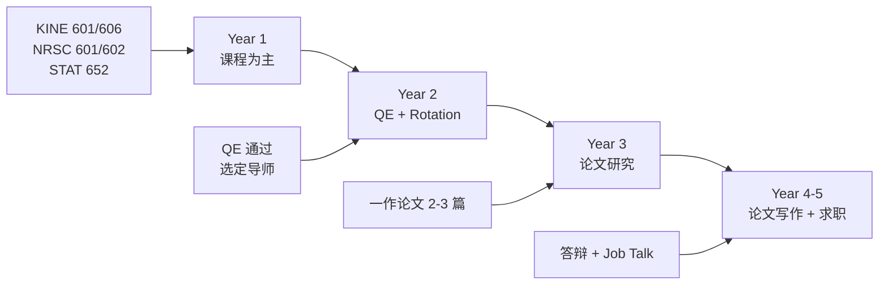
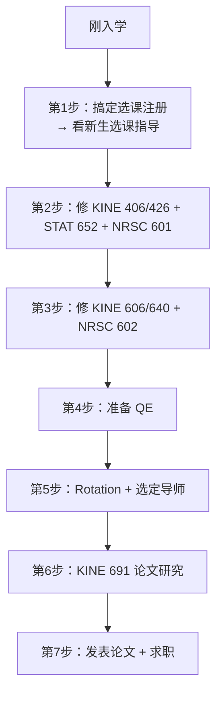

# 运动控制自学指南

!!! quote "写给每一位 TAMU Motor Neuroscience 直博生"
    > 博士之路是孤独的，但你不孤单。  
    > 这个网站记录了我作为 TAMU Kinesiology 系 Motor Neuroscience 方向直博生的真实学习路径——  
    > 从课程选择、实验技能、到论文写作与职业规划，希望它能为你节省摸索的时间。

---

## 🎯 关于本指南

本指南模仿 [CS自学指南](https://csdiy.wiki/) 的风格，专为 **Texas A&M University (TAMU) Kinesiology 系 Motor Neuroscience 方向博士生** 打造。

内容基于本人真实培养方案整理，涵盖：

- 📚 **必修课程**：TAMU 实际课程号与内容（KINE 601/606/640/641/642、NRSC 601-605、STAT 652/608/636/638/654、EDCI 660/661）
- 🔬 **研究方向**：Motor Control & Learning、Neurorehabilitation、Biomechanics、Computational Motor Neuroscience
- 🛠️ **学习工具**：文献管理（Zotero）、数据分析（R/Python）、实验设备使用（Vicon/Force Plates/sEMG/TMS）
- 🌐 **拓展资源**：Online 课程、学术会议（SfN/SMB/IEEE EMBS）、研究实验室、实习与就业方向

---

## 🗺️ 学习路线概览（TAMU 直博 5 年）



---

## 📋 课程地图（TAMU 实际课程号）

### 核心课程（Motor Neuroscience）

| 课程号 | 课程名称 | 学期 | 备注 |
|--------|----------|------|------|
| **KINE 601** | Proseminar in Kinesiology | Fall | 博士必修，系内研讨 |
| **KINE 606** | Motor Neuroscience I | Fall | ⭐ 核心课程 |
| **KINE 640** | Motor Neuroscience II | Spring | ⭐ KINE 606 后续 |
| **KINE 641** | Developmental Motor Neuroscience | Spring | 发展视角 |
| **KINE 642** | Self-Organization in Movement | Spring | 复杂系统视角 |

### 统计工具（必修 1 门 + 推荐多选）

| 课程号 | 课程名称 | 推荐度 |
|--------|----------|--------|
| **STAT 652** | Statistics for Experimenters I | ⭐⭐⭐⭐⭐ 强烈推荐 |
| **STAT 608** | Regression Analysis | ⭐⭐⭐⭐ |
| **STAT 636** | Statistical Computing | ⭐⭐⭐ |
| **STAT 638** | Introduction to Statistical Learning | ⭐⭐⭐⭐ |
| **STAT 654** | Bayesian Statistics | ⭐⭐⭐ |

### 神经科学基础（NRSC 系列）

| 课程号 | 课程名称 |
|--------|----------|
| **NRSC 601** | Systems Neuroscience |
| **NRSC 602** | Cellular & Molecular Neuroscience |
| **NRSC 603** | Behavioral Neuroscience |
| **NRSC 604** | Developmental Neuroscience |
| **NRSC 605** | Computational Neuroscience |
| **NRSC 642** | Ethical Conduct of Research（1 学分，必选）|

### 研究方法

| 课程号 | 课程名称 |
|--------|----------|
| **EDCI 660** | Measurement & Evaluation |
| **EDCI 661** | Instrument Design in Education |
| **KINE 681** | Seminar（每学期注册）|

---

## 🆕 新生必读

!!! info "刚拿到 Offer？先看这里"
    - 🔗 **[新生选课注册指导](新生选课注册指导.md)** — 国内本科直博的选课问题、先修课豁免、完整操作指南
    - 🔗 **[博士核心课程学习指南](博士核心课程学习指南.md)** — 五门核心课的超详细学习经验
    - 🔗 **[Preliminary Exam 备考指南](Preliminary_Exam_备考指南.md)** — 预备考试的全套备考策略

---

## 🔥 快速开始



---

## 📂 网站结构

```
kinesiology-motor-control-guide/
├── 必修课程/
│   ├── 核心课程/   ← KINE 601/606/640/641/642
│   ├── 统计工具/   ← STAT 652/608/636/638/654
│   └── 研究方法/   ← EDCI 660/661
├── 神经科学基础/    ← NRSC 601/602/603/604/605
├── 研究方向/        ← Motor Control/Learning, Neurorehab...
├── 学习工具/        ← 文献管理、数据分析、实验设备、学术写作
└── 拓展资源/        ← 在线课程、学术会议、实验室、就业
```

---

## 💡 给学弟学妹的话

!!! tip "来自学长的建议"
    1. **课程不是全部** — 尽早进实验室，动手做实验比上课学到的多
    2. **编程技能是保险** — 无论走学术界还是工业界，R/Python 都是核心竞争力
    3. **主动建立 Network** — 参加会议、主动与 Speaker 交流，这比发一篇论文更能打开机会
    4. **保持健康** — 博士长跑，身体和心理健康是第一位的
    5. **Plan B 很重要** — 学术界职位稀缺，多准备一条路（工业界 R&D / Data Science）

---

## 🔗 相关链接

- [TAMU KNSM 官网](https://knsm.tamu.edu/)
- [TAMU Course Catalog](https://catalog.tamu.edu/)
- [CS自学指南（灵感来源）](https://csdiy.wiki/)
- [本项目的 GitHub 仓库](https://github.com/etherealstarry/kinesiology-motor-control-guide)

---

## 📝 关于本网站

- **维护者**：etherealstarry（TAMU Kinesiology 直博生）
- **最后更新**：2026 年 5 月
- **许可证**：MIT License
- **贡献方式**：欢迎在 [GitHub](https://github.com/etherealstarry/kinesiology-motor-control-guide) 提 Issue 或 Pull Request！

---

> 💬 如果你觉得这个指南对你有帮助，或者想补充你自己的学习经验，欢迎随时联系我！  
> 博士之路不易，但彼此扶持，我们可以走得更远。
