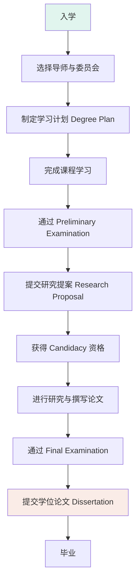

# 博士毕业要求详解

本页面详细解读 Texas A&M University Kinesiology PhD 的毕业要求，帮助你规划博士生涯。

## 📋 毕业流程总览

## 🎓 核心要求

### 1. 学分要求 (Credit Requirements)

| 入学背景 | 最低学分要求 | 说明 |
|---------|-------------|------|
| 已拥有硕士学位 | **60 学分** | 包括课程与研究学分 |
| 仅拥有学士学位 | **90 学分** | 包括课程与研究学分 |
| 国际 DDS/DMD/DVM/MD | **90 学分** | 美国境内同等学位为 60 学分 |

**重要说明**：
- 必须完成足够的 `691 (Research)` 研究学分
- 最多 **12 学分** 可来自转学学分
- 最多 **9 学分** 可为 400-level 本科高级课程

### 2. 学习计划 (Degree Plan)

**制定时间**：入学后尽快制定

**包含内容**：
- 所有将用于学位的课程列表
- 明确导师委员会成员
- 研究主题方向

**提交流程**：
1. 通过在线系统 [Document Processing Submission System (DPSS)](https://ogsdpss.tamu.edu/)
2. 在 **Final Examination 前 90 天** 必须获得批准
3. 批准后如需修改，需向 Graduate School 申请

### 3. 导师委员会 (Advisory Committee)

**组成要求**：
- 至少 **4 名成员**
- 主席 (Chair) 或共同主席必须来自主修系
- 至少 **1 名外部成员**（来自其他系/学院）

**职责**：
- 批准学习计划
- 指导研究方向和论文
- 主持考试 (Preliminary & Final Examination)
- 提供学术建议

---

## 📝 关键考试

### Preliminary Examination (预备考试)

**目的**：评估以下资格
1. 掌握所有专业领域的知识
2. 了解相关文献并具备文献研究能力
3. 理解研究问题并掌握适当的研究方法

**资格要求**：
- 学习计划已批准
- GPA ≥ 3.00
- 至少注册 1 学分
- 剩余课程 ≤ 6 学分（不包括 681, 684, 690, 691 等 S/U 课程）

**考试形式**：
- 笔试 和/或 口试
- 由考试委员会决定具体形式

**时间安排**：
- 最早：剩余 ≤ 6 学分课程时
- 最晚：完成课程后的下一学期结束前

**结果**：
- ✅ **通过**：可以继续博士学习
- ❌ **第一次失败**：可在 **6 个月后** 重考一次
- ❌ **第二次失败**：**不能继续博士学位学习**

**重要**：考试成绩 **4 年有效**，超时需重考！

---

### Final Examination (毕业论文答辩)

**目的**：评估博士学位候选人的综合能力与论文质量

**资格要求**：
- 已被录取为博士学位候选人 (Admission to Candidacy)
- 论文已接近完成并可供委员会审阅
- GPA ≥ 3.00
- 无 D/F/U 成绩未清除

**考试形式**：
- 主要围绕学位论文进行
- 可能包含笔试和口试
- 口试部分**公开进行**

**结果**：
- ✅ **通过**：完成博士学位要求
- ❌ **不通过**：**仅有一次机会**，必须慎重准备！

**重要**：Final Examination 成绩 **1 年有效**，超时需重考！

---

## 🔬 研究要求

### Research Proposal (研究提案)

**提交时间**：
- 完成课程学习后尽快提交
- 最晚在提交 Final Examination Request 前 **20 个工作日**

**内容要求**：
- 研究问题与目标
- 文献综述
- 研究方法与设计
- 预期结果与意义
- 研究时间表

**审批流程**：
1. 在导师委员会会议上答辩
2. 委员会评估研究可行性与设施条件
3. 通过 [ARCS 系统](https://arcs.tamu.edu/) 提交给 Graduate School
4. 获得批准后才能被录取为博士学位候选人

### Admission to Candidacy (录取为博士学位候选人)

**资格要求**：
1. ✅ 完成学习计划上的所有课程
2. ✅ GPA ≥ 3.00
3. ✅ 通过 Preliminary Examination
4. ✅ 研究提案获得批准
5. ✅ 满足住宿要求 (Residence Requirements)

**意义**：
- 正式进入论文研究阶段
- 可以专注于研究工作
- Final Examination 前必须获得此资格

### Dissertation (学位论文)

**要求**：
- 必须是**原创性研究**
- 展示独立研究能力
- 具有学术价值
- 写作质量达到出版标准

**提交流程**：
1. 通过 Final Examination 后
2. 根据委员会意见修改论文
3. 通过 [Thesis and Dissertation Submission System (Vireo)](https://etd.tamu.edu/)
4. 提交单个 PDF 文件
5. Graduate School 审核格式
6. 如需修改，根据反馈修订并重新提交

**格式要求**：
- 遵循 [Guidelines for Theses, Dissertations, and Records of Study](https://grad.tamu.edu/etd)
- 注意截止日期（每学期公布）

**费用**：
- 提交审理费（一次性）
- 通过后论文将被数字化存储并可在线访问

---

## ⏰ 时间限制

| 阶段 | 时间限制 | 说明 |
|------|----------|------|
| 完成课程 | 从入学起 **7 年** | 课程学分过期时间 |
| Preliminary Examination 成绩 | 通过之日起 **4 年** | 超时需重考 |
| Final Examination 成绩 | 通过之日起 **1 年** | 超时需重考 |
| 从入学到毕业 | 通常 **5-7 年** | 因研究方向而异 |

---

## 📚 课程要求详情

### 可转学分 (Transfer Credits)

**限制**：
- 最多 **12 学分** 或 **总学分的 1/3**（取较大值）
- 必须来自认可机构
- 成绩必须为 **B 或更高**
- **不能**用于其他学位

**不可转的学分**：
- ❌ 实习课程 (Internship)
- ❌ 论文学分 (Thesis/Dissertation Research)
- ❌ 继续教育、函授课程
- ❌ 少于 3 周的课程
- ❌ 无正式成绩的课程 (CR, P, S, U, H 等)

### 课程重复限制

- 最多 **2 次** 尝试 (Attempts)
- 第三次尝试需要 Dean 批准
- 计算 GPA 时**所有尝试都计入**

### S/U 评分课程

**仅以下课程** 可用 S/U 评分：
- 681 (Seminar)
- 684 (Professional Internship)
- 690 (Theory of Research)
- 691 (Research) ⭐ **重要**
- 692 (Professional Study)
- 693 (Professional Study)
- 695 (Frontiers in Research)
- 697 (Methods)
- 791 (Doctoral Capstone)

---

## 🎯 给你的建议

### 第一年
1. ✅ 与导师建立良好关系
2. ✅ 认真完成课程学习，保持高 GPA
3. ✅ 开始参与实验室会议，了解研究方向
4. ✅ 制定学习计划并获得批准

### 第二年
1. ✅ 深入参与研究项目
2. ✅ 准备 Preliminary Examination
3. ✅ 确定论文研究方向
4. ✅ 开始撰写 Research Proposal

### 第三年
1. ✅ 完成并通过 Preliminary Examination
2. ✅ 提交并 defended Research Proposal
3. ✅ 获得 Candidacy 资格
4. ✅ 全职进行论文研究

### 第四年及以后
1. ✅ 完成数据收集与分析
2. ✅ 撰写学位论文
3. ✅ 准备 Final Examination
4. ✅ 成功答辩并毕业！

---

## 📖 参考资源

### 官方文档
- [TAMU Graduate Catalog - Kinesiology PhD](https://catalog.tamu.edu/graduate/colleges-schools-interdisciplinary/education-human-development/kinesiology-sport-management/kinesiology-phd/)
- [Graduate and Professional School](https://grad.tamu.edu/)
- [Academic Requirements Completion System (ARCS)](https://arcs.tamu.edu/)

### 校内支持
- **Office of Research Compliance and Biosafety**：研究合规问题
- **Thesis and Dissertation Office**：论文格式指导
- **Writing Center**：学术写作支持

### 下载资源
- [博士毕业要求完整 PDF](./参考文档/TAMU_Kinesiology_PhD_毕业要求.pdf) 📥

---

## ❓ 常见问题

### Q1: 如果 Preliminary Examination 失败了怎么办？
**A**: 你有一次重考机会。考试委员会会在 10 个工作日内提供书面反馈，指出需要改进的地方。通常需要在 **6 个月后** 重考。

### Q2: 可以改变研究方向吗？
**A**: 可以，但需要：
1. 与当前导师充分沟通
2. 找到愿意接收你的新导师
3. 更新学习计划并提交审批
4. 可能会影响毕业时间

### Q3: 论文研究涉及人体或动物怎么办？
**A**: 必须在提交 Research Proposal 前获得相关伦理委员会批准：
- **IRB** (Institutional Review Board)：人体研究
- **IACUC** (Institutional Animal Care and Use Committee)：动物研究

### Q4: 可以在其他地方做研究吗？
**A**: 可以，但需要：
1. 获得导师委员会批准
2. 确保有合格的导师监督
3. 保持与 TAMU 的注册状态
4. 遵守 Graduate School 的相关规定

---

## 🔗 相关链接

- [研究方法与学术要求](研究方法与学术要求.md) - 考试与研究技能详解
- [学习规划](学习规划.md) - 分学年详细规划
- [必修课程](必修课程/核心课程/index.md) - 按课程学习
- [研究方向](研究方向/研究方向概述.md) - 了解研究方向
- [学习工具](学习工具/index.md) - 掌握研究工具

---

**最后更新**: 2026 年 5 月

> 💡 **提示**：这份要求非常详细且严格。建议**每学期初**都与导师委员会沟通进度，确保自己在正确的轨道上！
