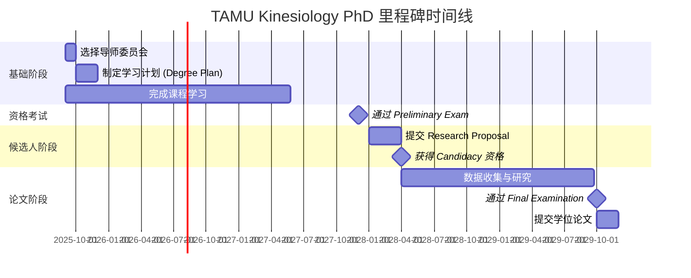

# TAMU 运动控制直博学习规划

本规划基于 **Texas A&M University Kinesiology PhD 官方毕业要求** 制定，结合你的个人研究兴趣，为直博生提供一个 **为期 5-7 年** 的系统学习规划。

> ⚠️ **重要说明**：本规划以官方毕业要求 PDF 为基础，具体选课请咨询你的导师和研究生协调员。直博生（无硕士学位）需要完成 **至少 90 学分**。

---

## 🗓️ 总体规划时间线

```
第1年：课程基础期 + 建立导师委员会
├── 第1学期（Fall）：核心课程 + 统计基础 + 选择导师
└── 第2学期（Spring）：神经科学基础 + 研究方法 + 制定学习计划

第2年：深入学习期 + 完成课程
├── 第3学期（Fall）：方向深入 + 开始研究
└── 第4学期（Spring）：完成剩余课程 + 准备 Preliminary Exam

第3年：资格考试期 + 研究提案
├── 第5学期（Fall）：通过 Preliminary Examination
└── 第6学期（Spring）：完成并提交 Research Proposal + 获得 Candidacy 资格

第4年：独立研究期
├── 第7学期（Fall）：数据收集 + 论文写作
└── 第8学期（Spring）：数据分析 + 第一篇发表

第5年：论文完成期
├── 第9学期（Fall）：论文写作 + 求职准备
└── 第10学期（Spring）：答辩 + 毕业
```

**时间限制（官方要求）**：
- ⏰ 从入学到毕业：**7 年最长**
- ⏰ Preliminary Examination 成绩有效期：**4 年**
- ⏰ Final Examination 成绩有效期：**1 年**

---

## 📚 博士毕业核心要求

### 1. 学分要求

| 入学背景 | 最低学分要求 | 说明 |
|---------|-------------|------|
| 已拥有硕士学位 | 60 学分 | 包括课程与研究学分 |
| **仅拥有学士学位（直博）** | **90 学分** | 包括课程与研究学分 |
| 国际 DDS/DMD/DVM/MD | 90 学分 | 美国境内同等学位为 60 学分 |

**重要说明**：
- 必须完成足够的 `691 (Research)` 研究学分
- 最多 **12 学分** 可来自转学学分
- 最多 **9 学分** 可为 400-level 本科高级课程
- **1/3 以上学分** 必须来自 TAMU 直接授课

### 2. 关键里程碑（按时间顺序）



---

## 📚 分学年详细规划

### 第1年：课程基础期 + 建立导师委员会

#### 第1学期（Fall 2025）

**目标**：完成核心运动神经科学课程，建立统计基础，**选择导师与委员会**

| 课程 | 重要性 | 时间投入 | 备注 |
|------|--------|----------|------|
| KINE 601 (Research) | ⭐⭐⭐ | 1小时/周 | 每个学期都要注册 |
| KINE 606 (Motor Neuroscience I) | ⭐⭐⭐⭐⭐ | 9小时/周 | **最核心课程** |
| STAT 652 (Statistics for Experimenters I) | ⭐⭐⭐⭐ | 9小时/周 | 统计基础必选 |
| STAT 654 (R/Python for Statistics) | ⭐⭐⭐ | 3小时/周 | 编程工具 |

**学期目标**：
- ✅ 掌握运动控制的核心概念和理论框架
- ✅ 理解神经解剖和生理系统的基础知识
- ✅ 掌握科研统计的基本方法
- ✅ **选择导师并组建 Advisory Committee**（至少 4 人，含 1 名外部成员）
- ✅ **制定 Degree Plan 并提交审批**

**重要任务**：
1. **选择导师**：与潜在导师面谈，确定研究方向匹配度
2. **组建委员会**：主席（通常即导师）+ 至少 3 名成员（含 1 名外部成员）
3. **制定学习计划**：与委员会共同制定，通过 [DPSS 系统](https://ogsdpss.tamu.edu/) 提交

**推荐学习资源**：
- 📖 [Principles of Neural Science (Kandel)](https://www.amazon.com/Principles-Neural-Science-Eric-Kandel/dp/0071390111) - 神经科学圣经
- 📖 [Motor Control and Learning (Schmidt & Lee)](https://www.humankinetics.com/products/motor-control-and-learning-6th-edition) - 运动控制经典
- 🎥 [MIT OpenCourseWare - Neuroscience](https://ocw.mit.edu/courses/brain-and-cognitive-sciences/) - 免费课程

---

#### 第2学期（Spring 2026）

**目标**：完成发展运动控制课程，深入统计方法

| 课程 | 重要性 | 时间投入 | 备注 |
|------|--------|----------|------|
| KINE 601 (Research) | ⭐⭐⭐ | 1小时/周 | 每个学期都要注册 |
| KINE 640 (Motor Neuroscience II) | ⭐⭐⭐⭐⭐ | 9小时/周 | **最核心课程** |
| KINE 641 (Motor Control & Learning - Developmental) | ⭐⭐⭐⭐ | 6小时/周 | 发展视角 |
| STAT 608 (Regression Analysis) | ⭐⭐⭐⭐ | 9小时/周 | 统计进阶必选 |

**学期目标**：
- ✅ 理解运动技能从婴儿到老年的发展轨迹
- ✅ 掌握回归分析
- ✅ 开始参与实验室会议，了解研究方向
- ✅ 开始阅读领域顶刊论文

**推荐学习资源**：
- 📖 [Developmental Motor Control (Spencer et al.)](https://www.elsevier.com/books/developmental-psychology/spencer/978-0-12-809664-0) - 发展运动控制
- 📖 [The Behavioral and Brain Sciences (Bernstein)](https://www.cambridge.org/core/books/degree-of-freedom/) - Bernstein 经典

---

### 第2年：深入学习期 + 完成课程

#### 第3学期（Fall 2026）

**目标**：深入学习研究方向课程，准备 Preliminary Examination

| 课程 | 重要性 | 时间投入 | 备注 |
|------|--------|----------|------|
| KINE 601 (Research) | ⭐⭐⭐ | 1小时/周 | 每个学期都要注册 |
| KINE 642 (Self-Organization Theory) | ⭐⭐⭐⭐ | 6小时/周 | 自组织理论 |
| KINE 627 (Exercise Biomechanics) | ⭐⭐⭐ | 6小时/周 | 生物力学 |
| STAT 636 (Multivariate Analysis) | ⭐⭐⭐⭐ | 9小时/周 | 多变量分析 |
| NRSC 601-602 (Principles of Neuroscience I/II) | ⭐⭐⭐⭐ | 6小时/周 | 神经科学基础 |

**学期目标**：
- ✅ 深入掌握研究方向的专业知识
- ✅ 开始实验室研究项目
- ✅ **开始准备 Preliminary Examination**
- ✅ 确定论文研究方向雏形

**Preliminary Examination 准备建议**：
1. 与导师确认考试形式（笔试/口试/组合）
2. 精读该方向 20-30 篇核心论文
3. 与高年级博士生交流经验
4. 提前 6 个月开始系统复习

---

#### 第4学期（Spring 2027）

**目标**：完成剩余课程，**通过 Preliminary Examination**

| 活动 | 重要性 | 时间投入 | 备注 |
|------|--------|----------|------|
| KINE 601 (Research) | ⭐⭐⭐ | 1小时/周 | 每个学期都要注册 |
| KINE 640 (Motor Neuroscience II) 或选修 | ⭐⭐⭐ | 6小时/周 | 根据委员会要求 |
| STAT 638 (Bayesian Statistics) | ⭐⭐⭐⭐ | 9小时/周 | 贝叶斯统计 |
| **Preliminary Examination** | ⭐⭐⭐⭐⭐ | 20小时/周 | **博士阶段最关键节点** |

**学期目标**：
- ✅ **顺利通过 Preliminary Examination**
- ✅ 完成所有课程学习（剩余 ≤ 6 学分）
- ✅ 开始撰写 Research Proposal 草稿
- ✅ 参加第一次学术会议并做海报展示

**Preliminary Exam 重要信息**：
- **资格要求**：GPA ≥ 3.00，学习计划已批准，注册至少 1 学分
- **失败后果**：第一次失败可在 6 个月后重考；第二次失败将**不能继续博士学位**
- **成绩有效期**：通过之日起 **4 年**

---

### 第3年：资格考试期 + 研究提案

#### 第5学期（Fall 2027）

**目标**：完成 Research Proposal，**获得 Candidacy 资格**

| 活动 | 重要性 | 时间投入 | 备注 |
|------|--------|----------|------|
| KINE 691 (Research) | ⭐⭐⭐⭐⭐ | 15小时/周 | 研究学分主力 |
| **Research Proposal 撰写** | ⭐⭐⭐⭐⭐ | 15小时/周 | **关键里程碑** |
| **提交 Research Proposal** | ⭐⭐⭐⭐⭐ | - | 通过 ARCS 系统 |
| **Admission to Candidacy** | ⭐⭐⭐⭐⭐ | - | **正式成为博士候选人** |

**学期目标**：
- ✅ 完成并提交 Research Proposal
- ✅ 通过委员会答辩
- ✅ **获得 Admission to Candidacy**
- ✅ 正式进入论文研究阶段（ABD - All But Dissertation）

**Research Proposal 内容要求**：
1. 研究问题与目标
2. 文献综述
3. 研究方法与设计
4. 预期结果与意义
5. 研究时间表

**Admission to Candidacy 资格要求**：
1. ✅ 完成学习计划上的所有课程
2. ✅ GPA ≥ 3.00
3. ✅ 通过 Preliminary Examination
4. ✅ Research Proposal 获得批准
5. ✅ 满足住宿要求 (Residence Requirements)

---

#### 第6学期（Spring 2028）

**目标**：全力进行数据收集和分析

| 活动 | 重要性 | 时间投入 | 备注 |
|------|--------|----------|------|
| KINE 691 (Research) | ⭐⭐⭐⭐⭐ | 30小时/周 | 全力投入 |
| 数据收集 | ⭐⭐⭐⭐⭐ | 20小时/周 | 实验核心阶段 |
| 数据分析 | ⭐⭐⭐⭐ | 10小时/周 | Python/R 实战 |
| 助教工作 | ⭐⭐ | 6小时/周 | 教学经验 |

**学期目标**：
- ✅ 完成主要实验数据收集
- ✅ 掌握 Python/R 数据分析工作流
- ✅ 完成第一篇期刊论文草稿
- ✅ 参加第二次学术会议

---

### 第4年：独立研究期

#### 第7学期（Fall 2028）

**目标**：完成数据分析，撰写论文

| 活动 | 重要性 | 时间投入 | 备注 |
|------|--------|----------|------|
| KINE 691 (Research) | ⭐⭐⭐⭐⭐ | 30小时/周 | 全力投入 |
| 数据分析 | ⭐⭐⭐⭐⭐ | 15小时/周 | 完成所有分析 |
| 论文写作 | ⭐⭐⭐⭐⭐ | 15小时/周 | 完成毕业论文草稿 |
| 期刊投稿 | ⭐⭐⭐⭐ | 5小时/周 | 第一篇论文投稿 |

**学期目标**：
- ✅ 完成所有数据分析
- ✅ 完成毕业论文（Dissertation）完整草稿
- ✅ 至少 1 篇第一作者论文被接收
- ✅ 开始准备求职材料（CV、研究陈述、教学陈述）

---

#### 第8学期（Spring 2029）

**目标**：完成论文，准备答辩

| 活动 | 重要性 | 时间投入 | 备注 |
|------|--------|----------|------|
| KINE 691 (Research) | ⭐⭐⭐⭐⭐ | 20小时/周 |  |
| 论文修改 | ⭐⭐⭐⭐⭐ | 20小时/周 | 根据委员会意见修改 |
| **Final Examination 准备** | ⭐⭐⭐⭐⭐ | 10小时/周 | **毕业论文答辩** |
| 求职申请 | ⭐⭐⭐⭐ | 10小时/周 | 投递申请材料 |

**学期目标**：
- ✅ 完成论文最终版本
- ✅ **通过 Final Examination（毕业论文答辩）**
- ✅ 提交最终论文至 Graduate School
- ✅ 确定毕业后的去向（Postdoc/教职/工业界）

**Final Examination 重要信息**：
- **资格要求**：论文已接近完成，GPA ≥ 3.00，已被录取为候选人
- **考试形式**：主要围绕学位论文进行，可能包含笔试和口试
- **口试部分公开进行**
- **仅有一次机会**！必须慎重准备
- **成绩有效期**：通过之日起 **1 年**

---

### 第5年：论文完成期（如需要）

#### 第9学期（Fall 2029）

**目标**：毕业后的过渡

| 活动 | 重要性 | 时间投入 | 备注 |
|------|--------|----------|------|
| 入职准备 | ⭐⭐⭐⭐⭐ | 20小时/周 | 搬家、签证（如需要） |
| 最后一篇论文 | ⭐⭐⭐⭐ | 10小时/周 | 完成待发表论文 |
| 学术网络 | ⭐⭐⭐ | 5小时/周 | 参加会议、建立合作 |

**学期目标**：
- ✅ 正式毕业（Graduation）
- ✅ 开始博士后/教职/工业界工作
- ✅ 建立独立的学术网络
- ✅ 规划未来 3-5 年的研究议程

---

## 🎯 不同毕业去向的准备重点

### 路径A：学术研究（终身教职 Track）

**适用人群**：希望在美国或中国高校找到终身教职（Tenure-Track）

**关键准备**：
- 发表 3-5 篇第一作者论文（顶刊：Journal of Neurophysiology, Cerebral Cortex, NeuroImage）
- 积累教学经验（担任 Instructor of Record）
- 申请博士后（Postdoc）作为过渡
- 参加 Job Market（通常在毕业前一年秋季）

**重要时间节点**：
- 博3秋季：准备 Job Market Materials
- 博4秋季：正式申请（Interview + Job Talk）
- 博4春季：收到 Offer，确定去向

---

### 路径B：工业界研发（Industry R&D）

**适用人群**：希望进入科技公司、医疗器械公司、运动品牌研发中心

**关键准备**：
- 掌握数据科学技能（Python, R, MATLAB）
- 完成 1-2 个 Industry 实习（如 Nike, Apple Health, Meta Reality Labs）
- 建立 Industry 人脉（参加 Society for Neuroscience, HUMAN 等会议）

**目标公司**：
- 🍎 Apple Health / Apple Watch 团队
- 📱 Google Fitbit / Verily
- 👟 Nike Sport Research Lab
- 🧠 Neuralink / Meta Reality Labs（神经接口方向）

---

### 路径C：中国高校教职

**适用人群**：希望回国在 985/211 高校找到教职

**关键准备**：
- 发表 2-3 篇第一作者论文（国内认可度高的期刊）
- 建立国际合作网络（与国外导师保持联系）
- 关注"海外优青"等人才项目
- 提前联系国内目标院校

**重要时间节点**：
- 毕业前 1 年：开始关注国内高校招聘信息
- 毕业前 6 个月：提交申请材料
- 毕业后 3-6 个月：完成入职手续

---

## 📋 年度进度检查表

### 第1年检查点
- [ ] 我选择了导师并组建了 Advisory Committee（至少 4 人）
- [ ] 我制定了 Degree Plan 并获得批准
- [ ] 我完成了所有第一年的必修课程（KINE 606, STAT 652 等）
- [ ] 我掌握了基础统计方法
- [ ] 我开始定期阅读领域顶刊论文

### 第2年检查点
- [ ] 我完成了所有课程学习（剩余 ≤ 6 学分）
- [ ] 我通过了 **Preliminary Examination**
- [ ] 我开始了独立研究项目
- [ ] 我积累了至少 1 次学术会议报告经验

### 第3年检查点
- [ ] 我提交了 **Research Proposal** 并获得批准
- [ ] 我获得了 **Admission to Candidacy**（博士候选人资格）
- [ ] 我完成了所有数据收集
- [ ] 我投稿了至少 1 篇第一作者论文

### 第4年检查点
- [ ] 我完成了毕业论文并最终定稿
- [ ] 我顺利通过了 **Final Examination**（毕业论文答辩）
- [ ] 我提交了最终论文至 Graduate School
- [ ] 我确定了毕业后的去向（Postdoc/教职/工业界）

### 第5年检查点（如需要）
- [ ] 我正式毕业（Graduation）
- [ ] 我开始了博士后/教职/工业界工作
- [ ] 我建立了独立的学术网络

---

## 💡 给 TAMU 直博生的学习建议

### 1. 主动与导师委员会沟通

- 每学期至少与导师 meeting 1-2 次（不仅限于组会）
- 提前准备 meeting 议程（Agenda）
- 主动汇报进展和困难，不要等导师问
- **及时沟通委员会成员变动**（如导师离职等特殊情况）

### 2. 尽早开始写作

- 不要等到数据收集完才开始写
- 先从 Methods 部分开始写
- 目标：每年完成 1-2 篇可投稿的论文
- 利用 [Texas A&M Writing Center](https://writingcenter.tamu.edu/) 的资源

### 3. 认真对待关键考试

- **Preliminary Examination**：仅有一次重考机会，必须充分准备
- **Final Examination**：仅有一次机会，答辩前必须确保论文质量
- 提前了解考试形式和评分标准

### 4. 建立学术网络

- 参加至少每年 1 次学术会议（SfN, NASPSPA, ISB）
- 主动与其他实验室的博士生和教授交流
- 建立 LinkedIn 和个人学术主页
- 加入专业学会（如 Society for Neuroscience, North American Society for the Psychology of Sport and Physical Activity）

### 5. 掌握可迁移技能

- 编程（Python/R/MATLAB）
- 数据分析（统计学、机器学习）
- 科学写作和演讲
- 这些技能在工业界也非常有价值

### 6. 保持工作-生活平衡

- 博士阶段是长跑，注意身心健康
- 定期运动（你自己就是最好的实验对象 😊）
- 建立支持系统（家人、朋友、同学）
- 利用 TAMU 的 [Counseling and Psychological Services](https://caps.tamu.edu/)

---

## 📖 按年份推荐的必读书籍

### 第1年必读
1. **Principles of Neural Science (Kandel)** - 神经科学基础
2. **Motor Control and Learning (Schmidt & Lee)** - 运动控制经典
3. **Statistical Methods (Snedecor & Cochran)** - 统计基础

### 第2年必读
1. **Dynamic Patterns (Kelso)** - 动态系统理论
2. **The Neuroscience of Human Movement (Cacace)** - 运动神经科学
3. **Experimental Design (Kirk)** - 实验设计

### 第3年必读
1. **The Craft of Research (Booth et al.)** - 科研写作
2. **They Say / I Say (Graff & Birkenstein)** - 学术写作
3. **Python for Data Analysis (McKinney)** - 数据分析实战

### 第4年必读
1. **The Academic Job Search Handbook (Miller)** - 求职指南
2. **Advice for a Young Investigator (Ramos)** - 青年研究者建议
3. **你的目标去向的相关专业书籍**

---

## 📖 结语

博士阶段是一个**漫长但有价值的旅程**。在 TAMU 的 Motor Neuroscience 方向，你将接受世界级的科研训练。

记住几点：

1. **主动学习**：不要等待导师告诉你每一步该做什么
2. **保持好奇**：科研的核心是提出好问题，而不仅仅是回答问题
3. **建立人脉**：你的同学和合作者将是未来学术生涯的重要支撑
4. **享受过程**：博士训练不仅是获得学位，更是成为独立研究者的过程
5. **注意时间限制**：7 年最长时限，合理规划每个阶段

**祝你在 TAMU 的博士旅程收获满满！** 🎓✨

---

## 📚 相关链接

- [博士毕业要求详解](博士毕业要求.md) - 详细解读官方毕业要求
- [研究方法与学术要求](研究方法与学术要求.md) - 考试与研究技能详解
- [必修课程](必修课程/核心课程/index.md) - 按课程学习
- [研究方向](研究方向/研究方向概述.md) - 了解研究方向
- [学习工具](学习工具/index.md) - 掌握研究工具

---

**最后更新**：2026年5月  
**维护者**：EtherealStarry  
**许可证**：MIT License

如有任何建议或修正，欢迎提交 [GitHub Issue](https://github.com/etherealstarry/kinesiology-motor-control-guide/issues)！
