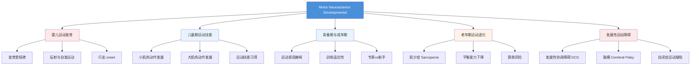

# KINE 641: Motor Neuroscience - Developmental Issues

**课程代码**: KINE 641  
**学分**: 3 credit hours  
**课程性质**: Motor Neuroscience 核心选修  

---

## 📖 课程简介

KINE 641 从**发展视角**探讨运动控制与运动学习，覆盖从婴儿期到老年期的运动行为变化。

本课程涵盖：
- 婴儿运动发育里程碑（抬头、翻身、坐、爬、走）
- 儿童期运动技能习得（小肌肉/大肌肉动作发展）
- 青春期与成年期运动表现的巅峰与维持
- 老年期运动退化（肌少症、平衡能力下降）
- 发展性运动障碍（DCD、脑瘫）的神经基础

---

## 🎯 学习目标

1. **描述**运动发育的关键期与敏感期
2. **解释**运动技能随年龄变化的神经机制
3. **设计**发展性运动干预方案
4. **分析**老化对运动控制的影响
5. **批判性评价**发展运动神经科学的前沿研究

---

## 📚 推荐教材

| 教材 | 作者 | 说明 |
|------|------|------|
| *Motor Development and Learning for Children* | =Pablo A. Saavedra | 运动发育经典教材 |
| *Developmental Psychomotor* | Jane E. Clark | 发展性运动控制 |
| *Handbook of Developmental Motor Neuroscience* | Jill Whitall & Virginia Way Digby | 参考手册 |

---

## 🔬 相关教授（TAMU KNSM）

| 教授 | 研究方向 | 个人主页 |
|------|------|------|
| 待补充 | 运动发育 / 发展性协调障碍 | 入学后补充 |

---

## 📝 学习建议

### 课前准备
- 复习 KINE 606/640 的运动控制基础理论
- 了解典型发育里程碑的时间线

### 课后任务
- **观察法**：观看婴儿/儿童运动视频，标注发育阶段
- **文献阅读**：每两周精读 1 篇发展运动神经科学论文
- **实践**：如有机会，参与 Lab 的发展性研究项目

---

## 🔗 相关资源

- [International Society for Motor Control](https://www.is-mc.org/)
- [Society for Research in Child Development (SRCD)](https://www.srcd.org/)

---

## 🧠 课程知识地图（思维导图）



---

## 📝 详细课程笔记

### Week 1-2：运动发育的理论基础

#### 发展运动神经科学的核心问题

1. **nature vs. nurture**：基因 vs. 环境，哪个更重要？
2. **连续性 vs. 阶段性**：发展是渐进的，还是有阶段的？
3. **普遍性 vs. 个体差异**：所有儿童都遵循相同的发展轨迹吗？

#### 主要理论框架

| 理论 | 代表人物 | 核心观点 | 批评 |
|------|----------|----------|------|
| **成熟理论**（Maturational Theory） | Gesell | 发育由基因决定，环境只影响速度 | 忽略环境的作用 |
| **动态系统理论**（Dynamic Systems） | Thelen, Smith | 发育是系统自组织的结果 | 难以预测个体差异 |
| **认知理论**（Cognitive Theory） | Piaget | 运动发展依赖认知发展 | 低估了婴儿的运动能力 |

**现代观点**：这三种理论**不是互斥的**，而是互补的。基因设定"范围"，环境决定"具体位置"。

---

### Week 3-4：婴儿运动发育里程碑

#### 关键里程碑时间表

| 月龄 | 技能 | 神经基础 |
|------|------|----------|
| **0-1 月** | 反射性运动（抓握反射、踏步反射） | 脊髓 + 脑干 |
| **2-3 月** | 抬头（Tummy Time） | 颈部肌肉力量增强 |
| **4-6 月** | 翻身（Roll） | 躯干控制 |
| **7-8 月** | 坐（Sit） | 平衡系统成熟 |
| **9-10 月** | 爬（Crawl） | 四肢协调 |
| **12-15 月** | 走（Walk） | 步行模式发生器成熟 |

**重要概念**：
- ** cephalocaudal 发展**：从头到脚（先控制头，再控制腿）
- ** proximodistal 发展**：从中心到外围（先控制躯干，再控制手指）

#### 行走 Onset 的机制

**核心问题**：为什么婴儿在 ~12 个月时才开始走路？

**传统解释**（肌肉力量）：
- 婴儿腿部肌肉不够强 → 无法支撑体重

**现代解释**（神经成熟）：
- 步行需要**中枢模式发生器（CPG）** 成熟
- 需要**感觉反馈系统**成熟（本体感觉、前庭）
- 需要**动机**（Motivation）——婴儿必须"想"走

**经典实验**：Thelen & Fisher (1982)

> **方法**：让婴儿在"婴儿 treadmill"上走路
> **发现**：即使 1 个月大的婴儿也能表现出步行样动作（踏步反射）
> **解释**：CPG 早已成熟，但**平衡控制**和**动机**限制了行走 onset

---

### Week 5-6：动态系统理论（Dynamic Systems Theory）

#### 核心概念：吸引力状态（Attractor States）

运动系统有多个"稳定状态"（Attractor States），发展是**从一个吸引子跳到另一个吸引子**的过程。

**例子**：行走 vs. 跑步
- 慢速行走是一个吸引子
- 快速跑步是另一个吸引子
- 中间速度（Transition Zone）是不稳定的 → 会"跳"到其中一个吸引子

#### 约束导向方法（Constraints-Led Approach）

运动行为由三种约束共同决定：

```
个体约束（Individual Constraints）
├── 身体尺寸（身高、体重）
├── 身体组成（肌肉力量、柔韧性）
└── 认知能力（注意力、记忆）

环境约束（Environmental Constraints）
├── 重力
├── 地面硬度
└── 温度

任务约束（Task Constraints）
├── 目标（拿杯子 vs. 扔球）
├── 规则（比赛规则）
└── 设备（球的大小、重量）
```

**应用**：如果你想改变某人的运动模式，**不要直接"教"**，而是**改变约束**。

**例子**：想让儿童学会正确的投掷动作？
- ❌ 传统方法：口头指令（"把手臂向后拉，然后向前甩"）
- ✅ 约束导向：用更重的球（迫使儿童用全身力量）→ 自然出现正确动作

---

### Week 7-8：儿童期运动技能习得

#### 运动学习的四个阶段（Fitts & Posner, 1967）

```
阶段 1：认知阶段（Cognitive Stage）
├── 需要大量注意力
├── 动作笨拙、不一致
└── 依赖视觉反馈
└── 语言指导有帮助

阶段 2：联结阶段（Associative Stage）
├── 动作逐渐流畅
├── 错误减少
└── 开始形成内部模型
└── 视觉反馈减少

阶段 3：自动阶段（Autonomous Stage）
├── 动作流畅、一致
├── 不需要注意力
└── 受干扰时容易"崩塌"（choking）
└── 可以同时做其他事（如边骑车边聊天）

阶段 4：专家阶段（Expert Stage）← 新增
├── 能灵活调整策略
├── 在压力下仍能保持表现
└── 能"直觉性"地解决问题
```

#### 练习安排：集中 vs. 分散

| 安排 | 定义 | 优点 | 缺点 |
|------|------|------|------|
| **集中练习**（Massed Practice） | 短时间内重复大量试次 | 学习速度快 | 容易疲劳，保持差 |
| **分散练习**（Distributed Practice） | 分多次、间隔练习 | 保持时间长 | 需要更多总时间 |
| **交错练习**（Interleaved Practice） | 混合多个技能练习 | 迁移效果好 | 初期表现差 |

**推荐**：对于**技能学习**，交错练习 + 分散练习是最好的组合。

---

### Week 9-10：青春期与成年期的运动表现

#### 运动表现的巅峰年龄

| 运动类型 | 巅峰年龄（平均） | 原因 |
|----------|------------------|------|
| **爆发力项目**（短跑、举重） | 20-25 岁 | 肌肉力量、神经传导速度 |
| **耐力项目**（马拉松） | 25-30 岁 | 最大摄氧量（VO2max） |
| **技巧项目**（体操、跳水） | 15-20 岁 | 柔韧性、体重轻 |
| **策略项目**（棋类、射击） | 30-40 岁 | 经验、心理素质 |

**个体差异**：以上只是平均值，个体差异可达 ± 5 年。

#### 专家 vs. 新手：什么 distinguishes them?

**Ericsson 的"刻意练习"理论**（Deliberate Practice）：

> 专家不是"天赋"，而是**累计练习时间**的函数。要达到专家水平，需要约 **10,000 小时**的刻意练习。

**批评**：
- 10,000 小时不是充分条件（很多人练了 10,000 小时也不是专家）
- 天赋（基因）仍然重要

**现代观点**：专家 = 天赋 + 刻意练习 + 机会

**运动领域的专家特征**：
1. **感知能力更强**（能提前预测对手动作）
2. **内部模型更准确**（能更精确地控制运动）
3. **注意力分配更高效**（能同时关注多个线索）

---

### Week 11-12：老年期运动退化

#### 老化对运动系统的影响

| 系统 | 老化效应 | 行为表现 |
|------|----------|----------|
| **肌肉系统** | 肌少症（Sarcopenia）| 力量下降、疲劳快 |
| **神经系统** | 神经元丢失、传导速度下降 | 反应时间变慢 |
| **平衡系统** | 前庭功能下降 | 平衡能力差、跌倒风险高 |
| **骨骼系统** | 骨质疏松 | 骨折风险高 |

**肌少症（Sarcopenia）**：
- 定义：年龄相关的肌肉质量 & 力量下降
- 发生率：60 岁后，肌肉质量每年下降 **1-2%**
- 后果：跌倒、骨折、失能

**预防**：
- **阻力训练**（Resistance Training）：最有效
- **蛋白质摄入**：1.2-1.6 g/kg/天（高于年轻人）
- **维生素 D**：缺乏会加速肌少症

#### 跌倒的生物力学

**跌倒的风险因素**：
- 步速慢（Gait Speed < 0.8 m/s）
- 步长变异性大（Stride Variability）
- 平衡恢复策略受损（不能快速迈步）

**干预**：
- **平衡训练**（如太极拳）
- **家庭环境改造**（去除地毯、增加扶手）
- **辅助设备**（拐杖、助行器）

---

### Week 13-14：发展性运动障碍

#### 发展性协调障碍（Developmental Coordination Disorder, DCD）

**诊断标准**（DSM-5）：
1. 运动协调显著低于年龄预期
2. 运动困难影响日常生活或学业表现
3. 症状在发育早期出现
4. 不是由其他疾病（如脑瘫）引起

**发生率**：约 **5-6%** 的学龄儿童

**核心缺陷**：
- **内部模型不准确**（不能精确预测动作结果）
- **感觉加权异常**（过度依赖视觉，本体感觉差）
- **执行功能缺陷**（不能灵活调整策略）

**干预**：
- **感知运动训练**（Perceptual-Motor Training）
- **认知取向训练**（Cognitive Orientation to daily Occupational Performance, CO-OP）
- **家庭支持**（家长教育）

#### 脑瘫（Cerebral Palsy, CP）

**定义**：出生前/出生时/出生后早期（< 2 岁）的**非进行性**脑损伤

**分类**（按运动类型）：
- **痉挛型**（Spastic）：70%，肌肉僵硬
- **运动障碍型**（Dyskinetic）：15%，不自主运动
- **共济失调型**（Ataxic）：5%，平衡差

**运动特征**：
- 肌张力异常（痉挛或低下）
- 反射异常（原始反射持续存在）
- 平衡能力差

**康复治疗**：
- **物理治疗**（PT）：改善运动功能
- **作业治疗**（OT）：改善日常生活技能
- **药物治疗**：肉毒杆菌（Botox）注射缓解痉挛
- **手术**：选择性脊神经后根切断术（SDR）

---

## 📚 经典论文导读

### 必读论文 1：Thelen, E., & Smith, L. B. (1994). *A Dynamic Systems Approach to the Development of Cognition and Action*. MIT Press.

**核心观点**：运动发展是**系统自组织**的结果，不是"成熟"的被动过程

**为什么重要**：动态系统理论是发展运动神经科学的**主导框架**

**如何读**：重点看 Chapter 2（Dynamic Systems Theory）和 Chapter 5（Walking Onset）

---

### 必读论文 2：Adolph, K. E., & Berger, S. E. (2006). *Motor development*. In Handbook of Child Psychology.

**核心观点**：运动发展是**积极探索**的过程，儿童通过"试错"学习

**为什么重要**：挑战了"成熟理论"，强调**主动性**

**如何读**：看"Exploratory Behavior"部分，以及 Figure 3（儿童如何探索不同地面）

---

### 必读论文 3：Wilson, P. H., et al. (2013). *Cognitive and neuroimaging findings in developmental coordination disorder*. Developmental Medicine & Child Neurology.

**核心观点**：DCD 的核心缺陷是**内部模型**和**感觉加权**异常

**为什么重要**：为 DCD 的**认知干预**提供了理论基础

**如何读**：看"Internal Model Deficits"和"Sensorimotor Integration"两节

---

## 🔬 课程项目建议

### 期末项目：设计一个发展性运动干预方案

**要求**：
1. 选择一个发展性运动障碍（DCD、CP、或老龄化）
2. 设计一个**基于理论的**干预方案
3. 解释为什么这个方法有效（理论机制）
4. 讨论潜在的混淆变量和限制

**示例题目**：
- "基于动态系统理论的 DCD 干预方案"
- "太极拳对老年人平衡能力的影响"
- "约束导向训练对脑瘫儿童行走能力的影响"

---

## 💡 学习技巧总结

1. **观察婴儿/儿童运动视频**（YouTube 有很多），标注发育阶段
2. **阅读经典论文**（Thelen & Smith, 1994），理解动态系统理论
3. **参加 Lab 的发展性研究项目**（如果有机会）
4. **用 Python 建模简单的动态系统**（如耦合振子）
5. **批判性地思考**：理论是否能解释所有现象？有没有反例？

---

*本页面由 EtherealStarry 维护，欢迎通过 GitHub PR 贡献内容。*
