# KINE 606: Motor Neuroscience I

**课程代码**: KINE 606  
**学分**: 3 credit hours  
**课程性质**: Motor Neuroscience 核心必修  

---

## 📖 课程简介

Motor Neuroscience I 是 TAMU Motor Neuroscience PhD 项目的第一门核心理论课，系统介绍**运动控制与运动学习**的神经科学基础。

本课程涵盖：
- 运动系统的神经解剖学
- 感觉运动整合（Sensorimotor Integration）
- 运动计划与运动执行
- 运动学习与记忆的神经机制
- 运动障碍的神经基础

---

## 🎯 学习目标

完成本课程后，你将能够：

1. **描述**运动控制系统的层次结构（脊髓 → 皮层下 → 皮层）
2. **解释**感觉信息如何指导运动输出
3. **分析**运动学习与记忆的神经可塑性机制
4. **比较**不同运动障碍（PD、中风、小脑损伤）的运动表现特征
5. **批判性评价**运动神经科学领域的经典与前沿研究

---

## 📚 推荐教材

| 教材 | 作者 | 说明 |
|------|------|------|
| *Motor Control and Learning* | Richard A. Schmidt & Tim Lee | 运动控制与学习经典教材 |
| *The Neuroscience of Human Movement* | Scott T. Grafton | 运动神经科学现代视角 |
| *Principles of Neural Science* | Kandel, Schwartz, Jessell | 神经科学圣经（参考相关章节）|

---

## 🔬 相关教授（TAMU KNSM）

| 教授 | 研究方向 | 个人主页 |
|------|------|------|
| **你的导师** | Motor Control / Motor Learning | 待补充 |
| TAMU KNSM Motor Neuroscience 方向教职 | 运动神经科学 | [KNSM Faculty](https://knsm.tamu.edu/faculty/) |

> 💡 **提示**：请在入学后补充你的导师及委员会成员信息。

---

## 📝 学习建议

### 课前准备
- 预习讲义 PDF，标记不懂的术语
- 复习神经解剖学基础（特别是运动皮层、小脑、基底节）

### 课中
- 积极提问，尤其是实验设计部分
- 跟随教授的思路，理解"为什么做这个实验"比"结果是什么"更重要

### 课后
- **每周精读 1-2 篇经典论文**（Journal Club 风格）
- 建立自己的概念地图（Concept Map）：把神经元 → 回路 → 行为联系起来
- 用 Anki 记忆关键概念（见[文献管理](../../学习工具/文献管理.md））

---

## 🔗 相关资源

- [TAMU KNSM 官网](https://knsm.tamu.edu/programs/motor-neuroscience-ph-d/)
- [Society for Neuroscience (SfN)](https://www.sfn.org/)
- [Motor Control 经典论文合集](https://scholar.google.com/)（搜索 "motor control review"）

---

## 📊 先修知识自查

在开始本课程前，请确保你熟悉以下内容：

- [ ] 基础神经解剖学（大脑皮层分区、丘脑、基底节、小脑、脊髓）
- [ ] 动作电位与突触传递原理
- [ ] 感觉系统基础（本体感觉、视觉、前庭）
- [ ] 统计学基础（t检验、ANOVA、相关分析）

> ⚠️ 如果以上有任何不熟悉，请先参考[学习规划](../../学习规划.md)中的基础补充资源。

---

## 💬 课程笔记

> 这里是记录课程笔记的好地方。你可以：
> - 用 Markdown 格式整理每节课的重点
> - 插入公式、图表、代码示例
> - 链接到相关论文

---

## 🧠 课程知识地图（思维导图）

```mermaid
graph TD
    A[Motor Neuroscience I] --> B[神经解剖基础]
    A --> C[感觉运动整合]
    A --> D[运动计划与执行]
    A --> E[运动学习与记忆]
    A --> F[运动障碍]
    
    B --> B1[脊髓: CPG 与反射]
    B --> B2[运动皮层: M1, PMd, PMv]
    B --> B3[小脑: 时序预测与内部模型]
    B --> B4[基底节: 动作选择与强化]
    
    C --> C1[本体感觉]
    C --> C2[视觉]
    C --> C3[前庭感觉]
    C --> C4[感觉加权与重校准]
    
    D --> D1[正向模型 vs 逆向模型]
    D --> D2[运动指令生成]
    D --> D3[前馈 vs 反馈控制]
    
    E --> E1[适应性学习]
    E --> E2[顺序学习]
    E --> E3[巩固与泛化]
    E --> E4[睡眠依赖巩固]
    
    F --> F1[帕金森病]
    F --> F2[中风]
    F --> F3[小脑损伤]
    F --> F4[脊髓损伤]
    
    style A fill:#4A90D9,color:#fff
    style B fill:#E8F4FD
    style C fill:#E8F4FD
    style D fill:#E8F4FD
    style E fill:#E8F4FD
    style F fill:#FDE8E8
```



---

## 📝 详细课程笔记

### Week 1-2：运动控制系统概述

#### 核心概念：运动控制的层次结构

```
层级 1（最高）：前额叶皮层 → 运动计划、决策
层级 2：运动皮层（M1, PMd, PMv）→ 运动指令生成
层级 3：皮层下结构（小脑、基底节）→ 运动优化、动作选择
层级 4（最低）：脊髓 → 反射、中枢模式发生器（CPG）
```

**关键知识点**：
- **中枢模式发生器（CPG）**：脊髓内的神经网络，可产生节律性运动模式（如行走），无需大脑持续输入
- **上运动神经元 vs 下运动神经元**：上运动神经元损伤（中风）→ 痉挛性瘫痪；下运动神经元损伤（脊髓损伤）→ 弛缓性瘫痪

#### 经典实验：Ghez & Krakauer (2000) - 运动控制的层次结构

> **实验设计**：让被试在不同条件下完成到达任务，记录运动轨迹误差
> **核心发现**：运动系统采用**前馈+反馈**的混合控制策略
> **对你的意义**：理解为什么中风患者的运动既慢又不准确（前馈控制受损）

---

### Week 3-4：神经解剖学基础

#### 运动皮层分区

| 区域 | 全称 | 功能 |
|------|------|------|
| **M1** | Primary Motor Cortex | 执行运动指令，直接投射到脊髓 |
| **PMd** | Dorsal Premotor Cortex | 外空间导向动作（"where"） |
| **PMv** | Ventral Premotor Cortex | 目标导向动作（"what"），镜像神经元 |
| **SMA** | Supplementary Motor Area | 内部驱动的动作序列 |
| **Pre-SMA** | Pre-Supplementary Motor Area | 动作准备与抑制 |

**重要联结**：
- M1 → 脊髓（皮质脊髓束）→ 直接控制肌肉
- 小脑 → M1（通过丘脑）→ 运动纠错
- 基底节 → M1（通过丘脑）→ 动作选择

#### 学习技巧：用 Anki 记忆皮层功能区

```
正面：经颅磁刺激（TMS）刺激 M1 会产生什么效果？
背面：引起对侧肌肉收缩（运动诱发电位，MEP）

正面：PMv 的镜像神经元在什么情况下激活？
背面：观察他人动作 + 自己执行动作时均激活
```

---

### Week 5-6：感觉运动整合（Sensorimotor Integration）

#### 核心理论：贝叶斯感知模型

运动系统需要整合多种感觉信息（本体感觉、视觉、前庭），但每种感觉都有噪声。**贝叶斯模型**解释了如何最优地整合这些信息：

$$
\hat{x} = \frac{1}{\sigma_v^2 + \sigma_p^2} \cdot v + \frac{1}{\sigma_p^2 + \sigma_v^2} \cdot p
$$

其中：
- $\hat{x}$ = 最优估计
- $v$ = 视觉信息， $\sigma_v^2$ = 视觉方差
- $p$ = 本体感觉信息， $\sigma_p^2$ = 本体感觉方差

**关键预测**：当某种感觉更可靠（方差更小）时，它的权重更大。

#### 经典实验：van Beers et al. (1999) - 感觉重校准

> **方法**：让被试在视觉偏移条件下（眼镜使视觉偏移）到达目标
> **发现**：经过适应，本体感觉会向视觉重校准（sensory realignment）
> **应用**：这解释了为什么戴 VR 眼镜一段时间后，摘下眼镜会感觉手的位置"不对"

---

### Week 7-8：运动计划（Motor Planning）

#### 最小干预原则（Minimal Intervention Principle）

运动系统**只纠正对任务目标有重要影响的偏差**，忽略不重要的偏差。

**例子**：拿杯子时，如果手指偏离轨迹但不影响最终抓握，系统不会纠正；但如果偏离会导致撞到障碍物，系统会立即纠正。

#### 最优反馈控制理论（Optimal Feedback Control, OFC）

与传统观点不同，OFC 理论认为：
- ❌ 传统观点：大脑预先计算完整的运动轨迹，然后执行
- ✅ OFC 观点：大脑只设定**目标状态**，运动过程中根据感觉反馈**实时调整**

**核心公式**（简化版）：

$$
u_t = K_t \cdot (x_t^* - x_t)
$$

其中 $u_t$ = 控制指令， $K_t$ = 反馈增益矩阵， $x_t^*$ = 目标状态， $x_t$ = 当前状态

**为什么这很重要？** 这解释了为什么运动系统能应对意外扰动（如有人推你一下，你能立即恢复平衡）。

---

### Week 9-10：内部模型（Internal Models）

#### 正向模型 vs 逆向模型

| 类型 | 输入 | 输出 | 功能 |
|------|------|------|------|
| **正向模型** | 运动指令 | 预测的感觉反馈 | 预测动作结果，检测意外 |
| **逆向模型** | 目标状态 | 所需运动指令 | 将感觉目标转换为运动指令 |

**类比**：
- 正向模型 = "如果我按这个键，屏幕会显示什么？"（预测）
- 逆向模型 = "我想让屏幕显示 X，应该按哪个键？"（逆推）

#### 经典实验：Flanagan & Wing (1997) - 运动前馈控制

> **方法**：让被试拿起不同重量的物体，记录握力
> **发现**：在物体离开桌面**之前**，握力就已经根据预期重量调整了
> **解释**：这是**前馈控制**的证据——大脑根据内部模型预测所需力量

---

### Week 11-12：运动学习（Motor Learning）

#### 运动学习的三个阶段

```
阶段 1：认知阶段（Cognitive Stage）
├── 需要大量注意力
├── 动作笨拙、不一致
└── 依赖视觉反馈

阶段 2：联结阶段（Associative Stage）
├── 动作逐渐流畅
├── 错误减少
└── 开始形成内部模型

阶段 3：自动阶段（Autonomous Stage）
├── 动作流畅、一致
├── 不需要注意力
└── 受干扰时容易"崩塌"（choking）
```

#### 运动学习的两种机制

| 机制 | 英文 | 时间尺度 | 例子 |
|------|------|----------|------|
| **适应性学习** | Adaptation | 短期（几分钟到几小时） | 拿错重量的杯子后，下次自动调整力量 |
| **获得性学习** | Acquisition | 长期（几天到几周） | 学会骑自行车、学会打字 |

**关键区别**：适应性学习是**参数调整**（内部模型不变，只调整增益）；获得性学习是**结构改变**（内部模型本身改变）。

---

### Week 13-14：运动记忆与巩固

#### 记忆巩固的双阶段模型

```
编码（Encoding）
    ↓
脆弱状态（容易遗忘）
    ↓
[ 离线巩固 ] ← 睡眠、休息
    ↓
稳定状态（不容易遗忘）
```

**关键发现**：
- **睡眠依赖巩固**：学习后的睡眠（特别是慢波睡眠）对运动记忆巩固至关重要
- **激活再现**（Reactivation）：睡眠中，学习时活跃的神经元会"重放"训练序列

#### 经典实验：Walker et al. (2002) - 睡眠对运动记忆的影响

> **方法**：让两组被试学习序列敲击任务，一组学习后保持清醒，一组学习后睡觉
> **发现**：睡觉组的记忆保持显著更好
> **对你的意义**：学习新技能后，**一定要保证当晚的睡眠**！

---

### Week 15-16：运动障碍（Movement Disorders）

#### 帕金森病（Parkinson's Disease, PD）

**病理**：黑质（Substantia Nigra）多巴胺能神经元退化 → 基底节回路异常

**运动症状**：
- 运动迟缓（Bradykinesia）
- 静止性震颤（Resting Tremor）
- 肌强直（Rigidity）
- 姿势不稳（Postural Instability）

**计算模型解释**：
- **强化学习模型**：PD 患者的**强化学习信号**（多巴胺）受损，导致动作选择困难
- **内部模型假设**：PD 患者的内部模型更新缓慢，导致运动计划不准确

#### 中风（Stroke）

**病理**：大脑血液供应中断 → 局部神经元死亡

**运动障碍**：
- 偏瘫（Hemiparesis/ Hemiplegia）
- 痉挛（Spasticity）
- 协同运动模式（Synergy Patterns）

**康复计算模型**：
- **神经可塑性**：通过**重复训练**，未受损区域可以"接管"部分功能
- **约束诱导运动疗法**（CIMT）：强制使用患侧手，促进可塑性

---

## 📚 经典论文导读

### 必读论文 1：Wolpert, D. M., Miall, R. C., & Diedrichsen, J. (2011). *Principles of sensorimotor integration*. Nature Reviews Neuroscience.

**核心观点**：感觉运动整合是一个**贝叶斯最优估计**问题

**为什么重要**：这是现代运动控制理论的基石，几乎所有后续研究都引用这篇论文

**如何读**：先看 Figure 1（感觉加权示意图），再读"Multisensory integration"部分

---

### 必读论文 2：Shadmehr, R., & Krakauer, J. W. (2008). *A computational neurobiology of reaching and reaching learning*. Brain.

**核心观点**：运动学习是**内部模型的更新过程**

**为什么重要**：首次系统提出运动学习的计算框架

**如何读**：重点看"Error-based learning"和"Reinforcement learning"两节

---

### 必读论文 3：Krakauer, J. W., & Mazzoni, P. (2011). *Human sensorimotor learning: adaptation, skill, and beyond*. Current Opinion in Neurobiology.

**核心观点**：区分**适应性学习**和**技能学习**是关键

**为什么重要**：澄清了运动学习领域的概念混淆

---

## 🔬 课程项目建议

### 期末项目：设计一个运动学习实验

**要求**：
1. 提出一个关于运动学习/控制的研究问题
2. 设计实验范式（被试内/被试间？需要什么设备？）
3. 预测可能的结果
4. 讨论潜在混淆变量和控制方法

**示例题目**：
- "视觉反馈延迟对运动学习的影响"
- "不同年龄组的运动适应性差异"
- "经颅磁刺激（TMS）对内部模型更新的影响"

---

## 💡 学习技巧总结

1. **每周用 Anki 复习核心概念**（见上方 Anki 示例）
2. **画概念地图**（Mind Map）：把神经元 → 回路 → 行为联系起来
3. **复现经典实验的分析**（用 Python/ MATLAB）
4. **参加 Journal Club**：每周精读 1 篇顶刊论文
5. **问"为什么"**：不要只记住结论，要理解实验设计背后的逻辑

---

*本页面由 EtherealStarry 维护，欢迎通过 GitHub PR 贡献内容。*
