# KINE 640: Motor Neuroscience II

**课程代码**: KINE 640  
**学分**: 3 credit hours  
**课程性质**: Motor Neuroscience 核心必修（KINE 606 的延续）  

---

## 📖 课程简介

Motor Neuroscience II 是 KINE 606 的进阶课程，深入探讨**高级运动控制理论**与**前沿研究方法**。

本课程重点涵盖：
- 高级运动控制模型（平衡点假设、主动推理、最优反馈控制）
- 运动学习的高级机制（迁移学习、睡眠依赖巩固）
- 社会运动神经科学（联合行动、动作观察网络）
- 计算精神病学视角下的运动障碍
- 经颅磁刺激（TMS）与经颅电刺激（tDCS）在运动研究中的应用

---

## 🎯 学习目标

1. **批判性评价**当代运动控制理论（FBS vs. OFC vs. Active Inference）
2. **设计**运动学习的实验范式
3. **解释**神经调控技术如何用于因果推断
4. **分析**运动障碍的计算模型
5. **撰写**高质量的研究提案（Grant Proposal）

---

## 📚 推荐教材与论文

| 类型 | 名称 | 说明 |
|------|------|------|
| 教材 | *Motor Control and Learning* (Schmidt & Lee) | 第5-6章：高级话题 |
| 论文 | Wolpert, D. M., et al. (2011). "Principles of signal-dependent noise" | 最优控制经典 |
| 论文 | Shadmehr, R., et al. (2010). "Error correction, sensory prediction, and adaptation" | 运动学习必读 |
| 论文 | Friston, K. (2011). "What is optimal about motor control?" | 主动推理视角 |
| 工具 | *Principles of Neural Science* (Kandel) | 第60-65章 |

---

## 🔬 相关实验室（TAMU KNSM）

| 实验室 | PI | 研究方向 |
|--------|-----|------|
| 待补充 | 你的导师 | 待补充 |

> 💡 入学后请补充你所在实验室及合作实验室的信息。

---

## 📝 学习建议

### 每周任务
- **精读 1 篇顶刊论文**（推荐：*Journal of Neurophysiology*, *Journal of Neuroscience*, *Nature Neuroscience*）
- **复现 1 个经典实验**的分析流程（用 Python/MATLAB）
- **参加 Lab Meeting**，主动提问

### 期末项目
- 撰写一份 **NSF GRFP** 风格的研究提案
- 包含：Specific Aims、Significance、Innovation、Approach
- 请导师/委员会成员审阅

---

## 🔗 相关资源

- [TAMU KNSM Motor Neuroscience](https://knsm.tamu.edu/programs/motor-neuroscience-ph-d/)
- [Society for Neuroscience (SfN)](https://www.sfn.org/)
- [arXiv Quantitative Biology](https://arxiv.org/list/q-bio.MN/recent)

---

## 🧠 课程知识地图（思维导图）

```mermaid
graph TD
    A[Motor Neuroscience II] --> B[高级运动控制理论]
    A --> C[运动学习高级机制]
    A --> D[社会运动神经科学]
    A --> E[计算精神病学]
    A --> F[神经调控技术]
    
    B --> B1[最优反馈控制 OFC]
    B --> B2[主动推理 Active Inference]
    B --> B3[平衡点假设 Equilibrium Point]
    B --> B4[理论比较与整合]
    
    C --> C1[迁移学习 Transfer]
    C --> C2[睡眠依赖巩固]
    C --> C3[上下文依赖学习]
    C --> C4[运动记忆系统]
    
    D --> D1[联合行动 Joint Action]
    D --> D2[动作观察网络]
    D --> D3[社会学习 Social Learning]
    
    E --> E1[运动障碍的计算模型]
    E --> E2[多巴胺与强化学习]
    E --> E3[成瘾与运动]
    
    F --> F1[TMS 原理与应用]
    F --> F2[tDCS/tACS 原理]
    F --> F3[神经调控实验设计]
    
    style A fill:#4A90D9,color:#fff
    style B fill:#E8F4FD
    style C fill:#E8F4FD
    style D fill:#E8F4FD
    style E fill:#FFF3E8
    style F fill:#E8FDE8
```



---

## 📝 详细课程笔记

### Week 1-2：运动控制理论综述

#### 三大理论框架对比

| 理论 | 核心思想 | 优点 | 缺点 |
|------|----------|------|------|
| **平衡点假设（EPH）** | 运动是通过调整肌肉平衡点实现的 | 简单，解释痉挛 | 难以解释快速运动 |
| **前向模型（Forward Model）** | 大脑预测动作结果，用预测误差校正 | 解释适应性和前馈控制 | 需要准确的感觉反馈 |
| **最优反馈控制（OFC）** | 实时计算最优控制策略 | 解释扰动应对、能量优化 | 计算复杂，难以验证 |

**关键争论**：OFC vs. 传统轨迹规划模型

- **传统观点**：大脑预先计算完整的运动轨迹（如最小 jerk 轨迹），然后执行
- **OFC 观点**：大脑只设定**目标状态**，运动过程中根据感觉反馈**实时计算**控制指令

**实验证据**（支持 OFC）：
- Liu & Todorov (2009)：让被试在运动过程中应对意外扰动，发现运动轨迹**不是预先确定的**，而是实时调整的

---

### Week 3-4：最优反馈控制理论（Optimal Feedback Control, OFC）

#### OFC 的核心公式

$$
\min_{u_{0:t}} \mathbb{E} \left[ \sum_{\tau=0}^{T} c(x_\tau, u_\tau) \right]
$$

其中：
- $x_\tau$ = 状态（如手的位置、速度）
- $u_\tau$ = 控制指令（如肌肉激活）
- $c(x, u)$ = 成本函数（通常包含：到达目标、最小化能量、最小化控制 effort）

**关键洞察**：OFC 不关心"轨迹形状"，只关心"最终状态"。这解释了为什么：
1. 运动轨迹在应对扰动时会**完全改变**（不是简单回到原轨迹）
2. 不同的人完成同一任务，轨迹可能**完全不同**（只要最终状态相同）

#### 成本函数的组成

```python
# 简化的成本函数（概念性）
def cost_function(state, control):
    # 1. 任务成本：到达目标
    task_cost = weight_task * (state - target)**2
    
    # 2. 能量成本：最小化肌肉激活
    effort_cost = weight_effort * control**2
    
    # 3.  smoothness 成本：最小化 jerk（加速度的导数）
    smoothness_cost = weight_smooth * jerk**2
    
    return task_cost + effort_cost + smoothness_cost
```

**为什么这很重要？** 通过调整权重，OFC 可以解释不同的运动策略（如：老年人更重视稳定性，因此增加 effort 权重）。

---

### Week 5-6：主动推理（Active Inference）

#### 主动推理的核心思想

主动推理是**自由能原理**（Free Energy Principle）在运动控制中的应用。核心观点：

> 大脑是一个**推理机器**，不断预测感觉输入。运动不是为了"执行动作"，而是为了**使感觉输入符合预测**。

**公式**（简化版）：

$$
F = D_{KL}[q(s) || p(s)] - \mathbb{E}_{q}[\ln p(o|s)]
$$

其中：
- $F$ = 自由能（Free Energy）
- $q(s)$ = 大脑对状态的信念
- $p(s)$ = 先验分布
- $p(o|s)$ = 似然函数（状态产生观察的概率）

**主动推理 vs. 最优控制**：
- **最优控制**：最小化预期成本 $\mathbb{E}[c(x, u)]$
- **主动推理**：最小化自由能 $F$（包含预测误差）

**为什么重要？** 主动推理提供了一个**统一框架**，可以同时解释感知、学习和决策。

#### 经典论文：Friston, K. (2011). *What is optimal about motor control?*

> **核心论点**：运动控制的"最优性"不是最小化成本，而是最小化预测误差
> **实验证据**：眼动（saccade）符合主动推理预测，但不一定符合最优控制预测
> **争议**：该理论计算复杂，难以用实验直接验证

---

### Week 7-8：运动学习的高级机制

#### 迁移学习（Transfer of Learning）

**核心问题**：在一个任务上学到的技能，能否迁移到另一个任务？

**两种迁移**：
1. **正向迁移**（Positive Transfer）：A 任务学习促进 B 任务学习
2. **负向迁移**（Negative Transfer）：A 任务学习干扰 B 任务学习

**关键发现**（Krakauer, 2006）：
- 如果两个任务的**内部模型相似**，会发生正向迁移
- 如果内部模型冲突，会发生负向迁移

**例子**：
- 正迁移：学会网球 → 学会壁球（都是挥拍运动）
- 负迁移：学会开汽车 → 学开飞机（转向操作相反）

#### 上下文依赖学习（Context-Dependent Learning）

**核心观点**：运动记忆是**上下文绑定**的（Context-Bound）

**实验范式**：让被试在不同环境下学习运动任务（如：不同的房间、不同的握把），然后测试迁移

**发现**：
- 如果测试环境和学习环境**相同**，表现更好
- 如果测试环境和学习环境**不同**，表现下降

**应用**：
- **技能学习**：训练环境应尽可能接近实际应用场景
- **康复治疗**：在医院训练的运动技能，可能在家庭环境中"丢失"

---

### Week 9-10：睡眠与运动记忆巩固

#### 睡眠依赖巩固的证据

**关键实验**：Walker et al. (2002)

> **方法**：被试学习序列敲击任务（Sequential Finger Tapping Task）
> **分组**：
> - 实验组：学习后睡觉（8小时睡眠）
> - 对照组：学习后保持清醒（8小时清醒）
> **结果**：睡眠组的记忆保持显著更好（约 20-30% 提升）

**机制**：
- **慢波睡眠（SWS）**：巩固**陈述性记忆**（Explicit Memory）
- **快速眼动睡眠（REM）**：巩固**程序性记忆**（Procedural Memory）

**对你的意义**：
- 学习新运动技能后，**一定要保证当晚的睡眠**
- 午睡（甚至 20 分钟）也能促进巩固

#### 激活再现（Reactivation）

**核心发现**：睡眠中，学习时活跃的神经元会"重放"（Replay）训练序列

**证据**（EEG/fMRI）：
- 学习时激活的脑区，在睡眠的慢波期间再次激活
- 这种"重放"与记忆巩固程度相关

**干预实验**：
- 在睡眠中播放与学习任务相关的**声音线索**，可以**增强**巩固（但效果因人而异）

---

### Week 11-12：社会运动神经科学（Social Motor Neuroscience）

#### 联合行动（Joint Action）

**定义**：两个或多个人**协调动作**来完成一个共同目标

**例子**：
- 抬重物（需要同步用力）
- 传球（需要预测对方的行动）
- 对话（需要轮流说话）

**神经机制**：
- **动作观察网络**（Action Observation Network, AON）：包含 PMv、顶叶皮层
- **镜像神经元系统**（Mirror Neuron System, MNS）：观察他人动作时激活

**关键实验**：Newman-Norlund et al. (2007)

> **方法**：让两个被试合作完成一个按键任务
> **发现**：合作时，脑电（EEG）显示**神经同步**（Neural Synchrony）
> **解释**：这可能反映了"共享内部模型"（Shared Internal Models）

---

### Week 13-14：神经调控技术（TMS & tDCS）

#### 经颅磁刺激（Transcranial Magnetic Stimulation, TMS）

**原理**：通过磁场在皮层诱导电流，从而**兴奋或抑制**神经元活动

**两种模式**：
1. **单脉冲 TMS**（Single-pulse）：刺激单个时间点
2. **重复性 TMS**（rTMS）：
   - 高频（> 5 Hz）→ 兴奋
   - 低频（≤ 1 Hz）→ 抑制

**在运动研究中的应用**：
- **干扰实验**（Interference Paradigm）：在运动学习过程中刺激 M1，观察学习是否受损
- **因果推断**：如果刺激某个脑区后行为改变，说明该脑区**必要**

**安全规范**：
- 刺激强度通常 ≤ 120% 运动阈值（Motor Threshold）
- 有癫痫史者**禁止**接受 TMS

#### 经颅电刺激（Transcranial Direct Current Stimulation, tDCS）

**原理**：通过微弱直流电（1-2 mA）调节神经元**静息膜电位**

**两种模式**：
1. **阳极 tDCS** → 去极化（兴奋）
2. **阴极 tDCS** → 超极化（抑制）

**优点**：
- 设备便宜（相比 TMS）
- 便携（可用于现场研究）
- 刺激时间长（通常 10-20 分钟）

**争议**：
- 效应量小（行为改变通常 < 10%）
- 个体差异大（有些人"响应者"，有些人"非响应者"）

---

### Week 15-16：计算精神病学（Computational Psychiatry）

#### 运动障碍的计算模型

**帕金森病（PD）的计算模型**：

| 模型 | 核心假设 | 预测 |
|------|----------|------|
| **强化学习模型** | 多巴胺信号受损 → 学习率降低 | PD 患者运动学习速度慢 |
| **内部模型模型** | 内部模型更新缓慢 | PD 患者适应性差 |
| **能量优化模型** | PD 患者过度重视"能量成本" | PD 动作缓慢（Bradykinesia） |

**证据**：
- PD 患者在**确定性环境**中表现正常，但在**不确定性环境**中表现差（支持强化学习模型）
- PD 患者的**使用依赖性反应**（Use-Dependent Effect）增强（支持内部模型模型）

#### 成瘾与运动（Addiction & Motor Control）

**核心观点**：成瘾物质（如可卡因、酒精）影响**多巴胺系统**，从而损害运动控制

**实验证据**：
- 成瘾者在**冲动抑制任务**（Go/No-Go Task）中表现差
- 这种损害与多巴胺 D2 受体可用性降低相关

**治疗启示**：运动训练（如跑步）可以增加多巴胺水平，可能有助于成瘾康复

---

## 📚 经典论文导读

### 必读论文 1：Wolpert, D. M., Diedrichsen, J., & Flanagan, J. R. (2011). *Principles of sensorimotor integration*. Nature Reviews Neuroscience.

**核心观点**：感觉运动整合是一个**贝叶斯最优估计**问题

**为什么重要**：这是现代运动控制理论的基石

**如何读**：先看 Figure 3（感觉加权），再读"Sensorimotor memory"部分

---

### 必读论文 2：Shadmehr, R., Smith, M. A., & Krakauer, J. W. (2010). *Error correction, sensory prediction, and adaptation in motor control*. Progress in Brain Research.

**核心观点**：运动学习是**预测误差的最小化**过程

**为什么重要**：首次系统提出"误差校正"的计算模型

**如何读**：重点看"Error-based learning"部分，以及 Figure 2（状态空间模型）

---

### 必读论文 3：Friston, K. (2011). *What is optimal about motor control?* Trends in Cognitive Sciences.

**核心观点**：运动控制的"最优性"是**最小化预测误差**，而不是最小化成本

**为什么重要**：提出了与最优控制理论**竞争**的框架

**如何读**：先读"Free energy and active inference"部分，再读"Motor control as active inference"

---

## 🔬 期末项目：撰写 NSF GRFP 风格的研究提案

### 项目要求

撰写一份 **NSF Graduate Research Fellowship Program (GRFP)** 风格的研究提案，包含：

1. **Personal Statement**（2 页）：你的研究背景、动机、职业目标
2. **Research Statement**（2 页）：具体的研究计划（包含背景、目标、方法、预期结果）

### 研究计划模板

```
Title: [简洁、具体，包含关键变量]

1. Introduction (0.5 页)
   - 研究背景
   - 研究问题（1-2 个具体问题）
   - 研究意义（理论 + 应用）

2. Preliminary Work (0.5 页)
   - 你已经做了什么（课程项目、实验室经验）
   - 初步数据（如果有）

3. Research Plan (1 页)
   - 实验 1：...
   - 实验 2：...
   - 数据分析计划

4. Broader Impacts (0.5 页)
   - 这项研究对社会有什么好处？
   - 你如何推广科学（Outreach）？
```

### 评分标准

| 维度 | 权重 | 说明 |
|------|------|------|
| **Intellectual Merit** | 50% | 研究的创新性、严谨性 |
| **Broader Impacts** | 50% | 研究的社会影响、推广价值 |

** Tips**：
- 尽早开始写（至少提前 1 个月）
- 请导师/委员会成员审阅（至少 2 轮反馈）
- 参考往年获奖提案（NSF GRFP 官网有公开样本）

---

## 💡 学习技巧总结

1. **每周精读 1 篇顶刊论文**（推荐：*Journal of Neuroscience*, *Nature Neuroscience*, *Neuron*）
2. **复现经典实验的分析**（用 Python/MATLAB）
3. **参加 Lab Meeting**，主动提问
4. **用 Overleaf 写提案草稿**（LaTeX 排版更专业）
5. **找学长/学姐 mock review**（模拟 NSF 评审）

---

*本页面由 EtherealStarry 维护，欢迎通过 GitHub PR 贡献内容。*
