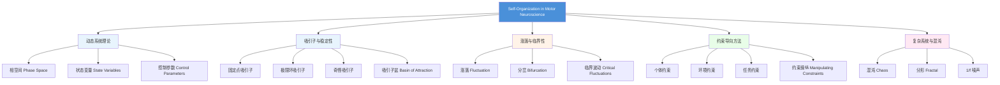

# KINE 642: Self Organization in Motor Neuroscience

**课程代码**: KINE 642  
**学分**: 3 credit hours  
**课程性质**: Motor Neuroscience 高级选修  

---

## 📖 课程简介

KINE 642 从**自组织理论**（Self-Organization）的视角理解运动控制，强调运动系统如何通过非线性动力学涌现出协调模式。

本课程涵盖：
- 动态系统理论（Dynamic Systems Theory）
- 吸引子（Attractor）与稳定性
- 涨落（Fluctuation）与临界性（Criticality）
- 约束导向方法（Constraints-Led Approach）
- 复杂系统与混沌理论在运动中的应用

---

## 🎯 学习目标

1. **解释**运动协调如何通过自组织涌现
2. **应用**动态系统理论分析运动模式转变
3. **设计**基于约束导向的实验范式
4. **批判性评价**传统运动控制理论与自组织理论的差异
5. **建模**简单的非线性运动系统

---

## 📚 推荐教材与论文

| 类型 | 名称 | 说明 |
|------|------|------|
| 教材 | *Dynamics of Coordinated Action* (Kelso, 1995) | 动态系统理论经典 |
| 教材 | *Self-Organization and Coordinating Funtions* (Turvey, 1990) | 基础论文集 |
| 论文 | Kelso, J. A. S. (1995). "Dynamic patterns..." | 核心文献 |
| 论文 | Thelen, E. & Smith, L. (1994). "A Dynamic Systems Approach..." | 发展视角 |
| 工具 | *Nonlinear Dynamics in Human Behavior* | 计算方法 |

---

## 🧑‍🏫 相关教授（TAMU KNSM）

| 教授 | 研究方向 | 个人主页 |
|------|------|------|
| 待补充 | 动态系统 / 运动协调 | 入学后补充 |

---

## 📝 学习建议

### 课前准备
- 复习非线性动力学基础（相空间、吸引子、分岔）
- 了解 Haken-Kelso-Bunz (HKB) 模型

### 课后任务
- **复现 HKB 实验**的数据分析（用 Python）
- **建模练习**：用 Python 模拟简单的耦合振子系统
- **阅读**：Kelso 的经典论文（每两周 1 篇）

### Python 示例代码（耦合振子）
```python
import numpy as np
import matplotlib.pyplot as plt

# 简化的 HKB 模型仿真
def hkb_model(phi, omega, k, dt=0.01, steps=10000):
    trajectory = [phi]
    for _ in range(steps):
        dphi = omega + k * np.sin(phi)
        phi = phi + dphi * dt
        trajectory.append(phi)
    return np.array(trajectory)

# 仿真相对相位轨迹
phi0 = 0.1  # 初始相对相位
traj = hkb_model(phi0, omega=0.5, k=-1.0)
plt.plot(traj[:500])
plt.title("HKB Model: Relative Phase Trajectory")
plt.show()
```

---

## 🔗 相关资源

- [International Society for Motor Control](https://www.is-mc.org/)
- [North American Society for the Psychology of Sport and Physical Activity (NASPSPA)](https://www.naspspa.com/)

---

## 🧠 课程知识地图（思维导图）



---

## 📝 详细课程笔记

### Week 1-2：动态系统理论（Dynamic Systems Theory, DST）基础

#### 什么是动态系统？

**定义**：一个由**状态变量**（State Variables）和**动力学方程**（Equations of Motion）描述的系统，其行为随时间演化。

**核心思想**：运动行为不是"预先编程"的，而是系统各组成部分**实时交互**的结果。

**数学表示**（简化版）：

$$
\frac{dx}{dt} = f(x, \mu)
$$

其中：
- $x$ = 状态变量（如关节角度、角速度）
- $\mu$ = 控制参数（如行走速度、地面坡度）
- $f$ = 动力学函数

**例子**：钟摆

$$
\frac{d^2\theta}{dt^2} + \frac{b}{m} \frac{d\theta}{dt} + \frac{g}{l} \sin(\theta) = 0
$$

其中：
- $\theta$ = 摆角（状态变量）
- $b$ = 阻尼系数
- $g$ = 重力加速度
- $l$ = 摆长

**为什么重要？** 这个简单的方程可以解释**行走 vs. 跑步**的转换（见后文"分岔"部分）。

---

### Week 3-4：吸引子（Attractors）与稳定性

#### 三种基本吸引子

| 类型 | 定义 | 例子 |
|------|------|------|
| **固定点吸引子**（Fixed-Point Attractor） | 系统趋向于一个**稳定状态** | 站立不动（平衡） |
| **极限环吸引子**（Limit-Cycle Attractor） | 系统趋向于一个**周期性轨道** | 行走、跑步、骑自行车 |
| **奇怪吸引子**（Strange Attractor） | 系统表现出**混沌**行为（看似随机，但有结构） | 某些病理性震颤 |

#### 吸引子盆（Basin of Attraction）

**定义**：所有能收敛到同一个吸引子的初始条件集合

**重要性**：
- 吸引子盆越大，系统越**稳定**（不容易被扰动"踢出去"）
- 吸引子盆越小，系统越**脆弱**

**应用**：康复训练
- 目标：扩大"正常行走"吸引子的吸引子盆
- 方法：通过**重复训练**，让系统"记住"这个吸引子

#### 经典实验：Thelen & Ulrich (1991) - 婴儿踢腿的动力学

> **方法**：让婴儿仰卧，记录踢腿动作
> **发现**：踢腿动作可以用**极限环吸引子**描述
> **意义**：首次证明即使是婴儿，运动也遵循动态系统规律

---

### Week 5-6：HKB 模型（Haken-Kelso-Bunz Model）

#### HKB 模型：手指协调的经典模型

**实验范式**：让被试同时摆动两个手指（食指和中指），逐渐加快摆动速度

**观察到的现象**：
1. **低速**：两个手指可以**同相**（In-phase, 相对相位 = 0°）或**反相**（Anti-phase, 相对相位 = 180°）摆动
2. **中速**：反相摆动变得不稳定
3. **高速**：系统**突然转换**到同相摆动（不能维持反相）

**数学模型**（简化版）：

$$
V(\phi) = -a \cos(\phi) - b \cos(2\phi)
$$

其中：
- $\phi$ = 相对相位（0° = 同相，180° = 反相）
- $V(\phi)$ = 势能函数
- $a, b$ = 控制参数（与摆动速度相关）

**关键预测**：
- 当 $b/a < 0.25$ 时，两个吸引子（0° 和 180°）都存在
- 当 $b/a > 0.25$ 时，180° 吸引子**消失**（分岔）

**为什么重要？** HKB 模型是**第一个**用动态系统理论成功解释运动协调的实验模型。

---

### Week 7-8：涨落（Fluctuation）与临界性（Criticality）

#### 涨落的作用：从噪声到信号

传统观点：涨落（噪声）是有害的，应该被抑制

**动态系统观点**：涨落是**探索新状态**的必要条件

**例子**：学习新运动技能时，初期的"抖动"（涨落）帮助系统找到新的吸引子

#### 临界波动（Critical Fluctuations）

**核心预测**：在**分岔点**附近，系统的行为会变得**极度不稳定**（临界波动）

**实验证据**（Kelso et al., 1986）：
- 在手指摆动速度接近"同相→反相"转换点时，相对相位的**变异性**急剧增加
- 这符合动态系统理论的预测

**应用**：
- **运动技能评估**：临界波动可能标志着"即将掌握新技能"
- **病理检测**：某些神经系统疾病（如帕金森病）会影响临界波动

---

### Week 9-10：约束导向方法（Constraints-Led Approach, CLA）

#### CLA 的核心思想

传统教学方法：
- 教练"告诉"运动员怎么做（口头指令）
- 运动员"复制"教练的动作

**问题**：每个人的身体条件不同，复制的动作可能不适合自己

**CLA 方法**：
- 不直接"教"动作
- 而是**操纵约束**（个体、环境、任务），让运动员**自己发现**最优动作

**例子**：教儿童投掷
- ❌ 传统：口头指令（"手臂向后拉，然后向前甩"）
- ✅ CLA：用**更重的球** → 儿童自然会用全身力量 → 动作自然改进

#### 操纵约束的具体方法

| 约束类型 | 如何操纵 | 例子 |
|----------|----------|------|
| **个体约束** | 改变身体状态 | 疲劳状态、负重、穿不同鞋子 |
| **环境约束** | 改变环境 | 不同地面（草地、沙滩）、不同坡度 |
| **任务约束** | 改变任务目标 | 用不同大小的球、改变目标距离 |

**应用**：运动训练
- **羽毛球**：在风大的环境下训练（操纵环境约束）→ 提高适应能力
- **足球**：用小号球训练（操纵任务约束）→ 提高控球精度

---

### Week 11-12：复杂系统与混沌（Chaos）

#### 什么是混沌？

**定义**：一个**确定性**系统，但行为**看似随机**（对初始条件极度敏感）

**关键特征**：
1. **确定性**（Deterministic）：没有随机输入
2. **对初始条件敏感**（Sensitive to Initial Conditions）："蝴蝶效应"
3. **奇怪吸引子**（Strange Attractor）：相空间轨迹有结构，但不重复

**例子**：双摆（Double Pendulum）
- 即使初始条件只差一点点，轨迹也会完全不同
- 但长期来看，轨迹仍然在"奇怪吸引子"内

#### 混沌在运动系统中的应用

**问题**：运动系统是混沌的吗？

**证据**（部分支持）：
- 心跳间隔（Heart Rate Variability, HRV）表现出**1/f 噪声**（混沌的特征）
- 步态变异性也表现出类似特征

**意义**：
- **健康系统**是"在边缘"（At the Edge of Chaos）——既不是完全可预测，也不是完全随机
- **病理系统**可能过于有序（如帕金森病的震颤，过于规律）或过于混乱（如某些 ataxia）

---

### Week 13-14：自组织与涌现（Emergence）

#### 涌现（Emergence）的定义

**核心思想**：整体行为**不能**通过单独分析各部分来预测

**例子**：
- **鸟群**：每只鸟只遵循简单规则（避免碰撞、朝向一致、靠近邻居），但整体出现复杂的编队
- **人群**：每个人只遵循简单的行走规则，但整体出现"人流"模式

#### 运动系统中的涌现

**问题**：运动协调是"预先编程"的，还是"涌现"的？

**实验证据**（支持涌现）：
- **中心模式发生器（CPG）**：脊髓中的神经网络可以产生节律性运动，无需大脑输入
- **耦合振子模型**：多个肢体（如手臂和腿）可以**自发同步**，无需"控制器"

**数学模型**（Kuramoto 模型）：

$$
\frac{d\theta_i}{dt} = \omega_i + \frac{K}{N} \sum_{j=1}^{N} \sin(\theta_j - \theta_i)
$$

其中：
- $\theta_i$ = 第 i 个振子的相位
- $\omega_i$ = 自然频率
- $K$ = 耦合强度

**预测**：当耦合强度 $K$ 足够大时，所有振子会**同步**（Phase Synchronization）

---

### Week 15-16：课程项目 - 建模练习

#### 项目要求

用 Python 建模一个简单的**自组织运动系统**，例如：
1. **耦合摆系统**（Coupled Pendulums）
2. **行走-跑步转换模型**（Walk-Run Transition）
3. **手指协调模型**（HKB Model）

#### 示例代码：HKB 模型仿真

```python
import numpy as np
import matplotlib.pyplot as plt
from scipy.integrate import solve_ivp

def hkb_model(t, phi, omega, k):
    """
    HKB 模型微分方程
    d(phi)/dt = omega - k * sin(phi)
    """
    dphi_dt = omega - k * np.sin(phi)
    return dphi_dt

# 参数
omega = 0.5  # 自然频率差
k = -1.0     # 耦合强度

# 初始条件
phi0 = np.pi / 6  # 30° 初始相对相位

# 仿真
t_span = (0, 50)
t_eval = np.linspace(0, 50, 1000)
sol = solve_ivp(hkb_model, t_span, [phi0], args=(omega, k), t_eval=t_eval)

# 绘图
plt.figure(figsize=(10, 4))
plt.subplot(1, 2, 1)
plt.plot(sol.t, sol.y[0] * 180 / np.pi)
plt.xlabel('Time (s)')
plt.ylabel('Relative Phase (degrees)')
plt.title('HKB Model: Phase Trajectory')

plt.subplot(1, 2, 2)
plt.plot(sol.y[0] * 180 / np.pi, np.gradient(sol.y[0]), 'o-')
plt.xlabel('Phase (degrees)')
plt.ylabel('d(Phase)/dt')
plt.title('Phase Space Portrait')

plt.tight_layout()
plt.show()
```

**任务**：
1. 运行以上代码
2. 改变参数 `omega` 和 `k`，观察系统行为变化
3. 尝试实现"分岔"（当 `k` 变化时，吸引子消失）

---

## 📚 经典论文导读

### 必读论文 1：Kelso, J. A. S. (1995). *Dynamic patterns: The self-organization of brain and behavior*. MIT Press.

**核心观点**：运动协调是**自组织**的结果，可以用动态系统理论描述

**为什么重要**：这是动态系统理论在运动科学中的**奠基之作**

**如何读**：重点看 Chapter 4（HKB Model）和 Chapter 7（Applications）

---

### 必读论文 2：Thelen, E., & Smith, L. B. (1994). *A Dynamic Systems Approach to the Development of Cognition and Action*. MIT Press.

**核心观点**：发展是**系统自组织**的过程

**为什么重要**：将动态系统理论应用到发展领域

**如何读**：看 Chapter 3（Dynamic Systems Theory）和 Chapter 8（Walking Onset）

---

### 必读论文 3：Haken, H., Kelso, J. A. S., & Bunz, H. (1985). *A theoretical model of phase transitions in human hand movements*. Biological Cybernetics.

**核心观点**：手指协调的"同相→反相"转换是一个**分岔**过程

**为什么重要**：首次用动态系统理论**定量预测**运动行为

**如何读**：看数学模型部分（Equation 1-5），以及 Figure 2（分岔图）

---

## 💡 学习技巧总结

1. **用 Python 仿真动态系统**（见上方代码示例）
2. **观察日常运动中的自组织现象**（如：行人流、鸟群）
3. **批判性地思考**：传统理论与动态系统理论，哪个更好？
4. **阅读 K elso 的经典论文**（每两周 1 篇）
5. **参加 Lab 的动态系统研究项目**（如果有机会）

---

*本页面由 EtherealStarry 维护，欢迎通过 GitHub PR 贡献内容。*
