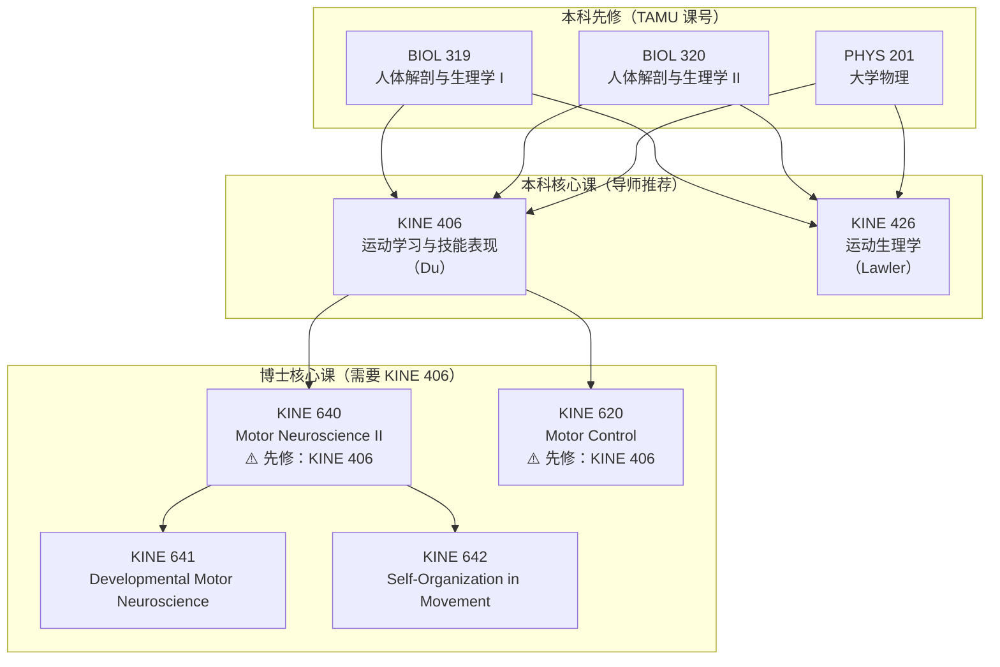

# 新生选课注册指导

!!! warning "适用人群"
    国内本科直博、国际学生、先修课程未被 TAMU 系统自动识别的新入学博士生。

---

## 🔍 你的情况：问题诊断

如果你是 **国内本科直博**（如南京医科大学康复医学 → TAMU Kinesiology PhD），注册系统会报错：

> *"Prerequisites not met — you need BIOL 319, BIOL 320, PHYS 201 before enrolling in KINE 406/426"*

**这不是你能力不够，是系统不认识你的成绩单。** 你在国内修过的解剖、生理、物理课程，在 TAMU 系统里没有自动等价映射。

---

## 📊 先修课程链完整分析

### 本科课 → 研究生课的依赖关系

### 每个课程的先修要求

| 课程 | 课程号 | 学分 | 先修要求 | 你的情况 |
|------|--------|------|----------|----------|
| 运动学习与技能表现 | **KINE 406**（本科） | 3 | BIOL 319, PHYS 201 (C+) + 同时注册 BIOL 320 + Junior/Senior | 🔴 系统不认国内成绩单 |
| 运动生理学 | **KINE 426**（本科） | 3 | BIOL 319, BIOL 320, PHYS 201 (C+) + Junior/Senior | 🔴 同上 |
| Motor Neuroscience II | **KINE 640**（博士） | 3 | KINE 406 或等同 | 🔴 先得解决 KINE 406 |
| Motor Control | **KINE 620**（博士） | 3 | KINE 406 或等同 | 🔴 先得解决 KINE 406 |
| Proseminar | **KINE 601**（博士） | 1-3 | 无 | 🟢 **直接可注册！** |
| Motor Neuroscience I | **KINE 606**（博士） | 3 | 研究生分类 | 🟡 可能需要导师审批 |
| 统计类课程 | **STAT 652** 等 | 3 | 研究生分类 | 🟢 大部分可直接注册 |

---

## ⚠️ 核心建议：不要换课！

!!! danger "导师推荐 KINE 406 + 426 是有道理的"
    
    **为什么不能换：**
    
    1. **KINE 406 是后续所有 Motor Neuroscience 博士课的先修**。如果你不修 406，KINE 640/641/642/620 全部注册不了。这不是跳过一个，是堵死一整条路。
    2. **426 是 Prelim 考试核心内容**。运动生理学（Exercise Physiology）是预备考试的重要组成部分，Lawler 就是你未来的考试委员之一。
    3. **这两门课的教授就是你未来的导师候选人**。Yue Du（406）和 John Lawler（426）都是系内重要教授，课上表现好 = 潜在的 Rotation 机会。

    **唯一的问题是你需要拿到先修课豁免（Prerequisite Override），而不是换课。**

---

## ✅ 解决方案总览

### 方案一：先修课豁免（Prerequisite Override）⭐ 推荐首选

**核心思路**：用你在南医大修过的课程证明你已经具备 BIOL 319/320/PHYS 201 的知识。

| 你要证明的 TAMU 课 | 你在南医大对应的课 | 怎么证明 |
|---------------------|---------------------|----------|
| BIOL 319（人体解剖与生理学 I） | 系统解剖学、生理学 | 本科成绩单 + 课程大纲（中英对照） |
| BIOL 320（人体解剖与生理学 II） | 病理生理学、临床医学课程 | 同上 |
| PHYS 201（大学物理） | 医用物理学 | 同上 |

#### 操作步骤

1. **准备材料**
   - 南医大英文成绩单（如有）或中文成绩单 + 自行翻译
   - 相关课程的教学大纲（syllabus），标注出与 BIOL 319/320/PHYS 201 重叠的内容
   - 如无英文成绩单，准备一个简单的课程等价说明表

2. **联系 KNSM 研究生咨询办公室**
   - 邮箱：`knsm-grad@tamu.edu`
   - 电话：979-845-4530
   - 办公地址：Gilchrist Suite 143
   - 说明你是新录取的博士生，需要先修课豁免

3. **同时联系授课教授**
   - KINE 406（Yue Du）：说明你的背景 → 看下方邮件模板
   - KINE 426（John Lawler）：同上

### 方案二：教授直接授权（Instructor Approval）

如果先修课豁免流程太慢，直接请教授给你加权限。

!!! tip "成功率更高"
    TAMU 课程目录明确写了 **"or approval of instructor"** 作为替代条件之一。教授可以直接绕过系统限制。

### 方案三：先上不需要先修的课 + 等 override 处理

在等待豁免审批期间，先注册下面这些课：

---

## 🟢 现在就能注册的课程

以下课程对博士生**无先修要求**或只需要"研究生分类"即可：

| 课程号 | 名称 | 学分 | 学期 | 为什么先上 |
|--------|------|------|------|-----------|
| **KINE 601** | Proseminar in Kinesiology | 1-3 | Fall | 🔥 博士必修！新生必上，全系师生都会见到你 |
| **KINE 681** | Seminar | 1 | 每学期 | 系内学术报告，了解研究动态 |
| **KINE 691** | Research | 1-9 | 每学期 | 跟随导师做研究 |
| **STAT 652** | Statistics for Experimenters I | 3 | Fall | 实验统计基础，Prelim 必备 |
| **NRSC 601** | Systems Neuroscience | 3 | Fall | 系统神经科学基础 |
| **KINE 685** | Directed Studies | 1-3 | 每学期 | 跟教授做定向研究（需教授同意） |

### 推荐第一学期课表（等 override 期间）

| 课程 | 学分 | 说明 |
|------|------|------|
| KINE 601 Proseminar | 1 | 必修，全系见面 |
| STAT 652 统计 | 3 | 实验统计，Prelim 核心 |
| NRSC 601 系统神经科学 | 3 | 神经科学基础 |
| KINE 685 定向研究 | 1-3 | 跟导师或意向教授做研究 |
| **合计** | **8-10** | 满足全日制要求（9学分） |

---

## 📧 邮件模板

### 给教授的邮件（中英双语参考）

**Subject**: Prerequisite Override Request — KINE 406, Fall 2026 — New PhD Student

---

Dear Professor [Du / Lawler],

My name is [你的名字], and I am an incoming PhD student in the Motor Neuroscience program. My faculty advisor, [导师名字], recommended that I enroll in your course KINE [406/426] this fall.

However, I am unable to register because the system requires prerequisite courses (BIOL 319, BIOL 320, PHYS 201) that I completed during my undergraduate studies at [南医大英文名 / Nanjing Medical University] in China. My degree was in Rehabilitation Medicine (康复医学), which included extensive coursework in:

- Human Anatomy & Physiology (系统解剖学、生理学) — equivalent to BIOL 319/320
- Medical Physics (医用物理学) — equivalent to PHYS 201
- Clinical Medicine and Pathophysiology — supplementing the above

I have the relevant transcripts and course syllabi available if needed. Would it be possible for you to grant an instructor override so I can register for KINE [406/426]?

Thank you for your time and consideration.

Best regards,
[你的名字]
[UIN]
PhD Student, Kinesiology — Motor Neuroscience
Texas A&M University

---

!!! info "中文速览"
    邮件要点：自我介绍 → 说明导师推荐 → 解释系统问题（国内成绩单不被识别）→ 列出已有相关课程 → 请求 override。附上成绩单和课程大纲效果最好。

### 给 KNSM 研究生咨询的邮件

**Subject**: Registration Issue — Prerequisite Override for Incoming PhD Student (UIN: XXX)

---

Dear KNSM Graduate Advising,

I am a newly admitted PhD student in Kinesiology (Motor Neuroscience) for Fall 2026. I am trying to register for KINE 406 and KINE 426 as recommended by my faculty advisor, but the system indicates that prerequisites (BIOL 319, BIOL 320, PHYS 201) are not met.

I completed equivalent coursework during my undergraduate degree at Nanjing Medical University (Rehabilitation Medicine). My international transcript has not yet been evaluated for equivalency in the TAMU system.

Could you please advise on the process to obtain a prerequisite override for these courses? I can provide my undergraduate transcript and course syllabi upon request.

Thank you,
[你的名字]
UIN: [XXX]

---

## 📋 完整行动清单

!!! check "按顺序完成"
    - [ ] **Step 1**：登录 Howdy → 确认 KINE 406/426 的具体报错信息（截图保存）
    - [ ] **Step 2**：准备南医大成绩单（中英对照）和相关课程的教学大纲
    - [ ] **Step 3**：给 Yue Du（406）和 John Lawler（426）分别发邮件请求 instructor override
    - [ ] **Step 4**：给 knsm-grad@tamu.edu 发邮件请求 prerequisite override
    - [ ] **Step 5**：同时注册 KINE 601 + STAT 652 + NRSC 601 作为保底
    - [ ] **Step 6**：等待 override 审批（通常 3-10 个工作日）
    - [ ] **Step 7**：override 通过后补注册 KINE 406 + 426

---

## 📅 推荐的完整选课路径（Year 1）

### Fall 2026（第一学期）

| 课程 | 学分 | 难度 | 说明 |
|------|------|------|------|
| **KINE 406** 运动学习与技能表现 | 3 | ⭐⭐⭐ | 需 override，Du 授课 |
| **KINE 426** 运动生理学 | 3 | ⭐⭐⭐⭐ | 需 override，Lawler 授课 |
| **KINE 601** Proseminar | 1 | ⭐ | 必修，无需先修 |
| **STAT 652** 实验统计 | 3 | ⭐⭐⭐⭐ | 统计基础，强烈推荐 |
| **合计** | **10** | | 充实但不超负荷 |

### Spring 2027（第二学期）

| 课程 | 学分 | 说明 |
|------|------|------|
| **KINE 606** Motor Neuroscience I | 3 | 有了 406 基础后正合适 |
| **KINE 620** Motor Control | 3 | 需要 KINE 406 先修 |
| **STAT 608** 回归分析 | 3 | 统计进阶 |
| **KINE 691** Research | 1-3 | 开始 Rotation |
| **合计** | **10-12** | |

---

## ❓ 常见问题

**Q：如果 override 被拒怎么办？**

A：KINE 406 的先修还有一个关键词是 **"or equivalent"**。你的南医大课程就是 equivalent。如果被拒，让导师出面联系系主任（Buchanan），博士生入学时很多都有这种情况。

**Q：能不能先上 KINE 604（统计）代替 426？**

A：KINE 604 是研究生统计课，也需要研究生分类。但 426 是生理学内容，604 是统计学内容——两者不能互相替代。426 是 Prelim 考试内容，必须学。

**Q：KINE 406 和 KINE 426 压力大吗？能不能同时上？**

A：406（Du）侧重理论和方法（Fitts & Posner、Schema Theory、运动学习实验设计），426（Lawler）侧重生理机制（肌肉、心血管、能量代谢）。两门内容不重叠，同时上可行。参考历史数据：406 有 3 次测试 + 6 次 quiz + 项目；426 有 4 次考试。

**Q：如果 406/426 都注册不了，我该上什么？**

A：先上 KINE 601 + STAT 652 + NRSC 601，同时推进 override。最坏情况下，和导师商量是否能先做 KINE 685 定向研究，Spring 再补 406/426。

---

## 📞 关键联系方式速查

| 联系对象 | 邮箱 | 电话 | 用途 |
|----------|------|------|------|
| KNSM 研究生咨询 | knsm-grad@tamu.edu | 979-845-4530 | 先修课豁免、注册问题 |
| John J. Buchanan (Program Chair) | jjbuchanan@tamu.edu | — | 课程体系问题、Prelim 安排 |
| Yue Du (KINE 406) | — | — | 406 instructor override |
| John Lawler (KINE 426) | jlawler@tamu.edu | — | 426 instructor override |
| Howdy 技术支持 | — | 979-845-8300 | 系统技术问题 |

---

> 💡 **一句话总结**：你不应该换课。406 和 426 是你博士阶段最关键的两门基础课。你面临的只是国际学生成绩单映射的系统问题，找对联系人、发对邮件，一周内就能解决。
