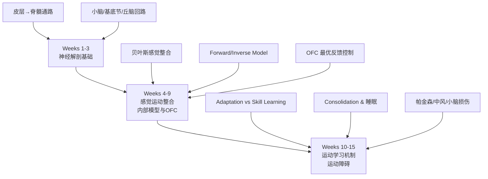

# KINE 606: Motor Neuroscience I

> 博士第一门核心理论课 | 3 学分 | Fall 学期 | Buchanan / Wright 授课

---

## 📋 课程信息

| 维度 | 详情 |
|------|------|
| 学分 | 3 |
| 学期 | Fall（第一学期） |
| 先修 | 研究生分类 |
| 班级规模 | 8-12 人 |
| 授课教授 | John J. Buchanan 或 David L. Wright（轮换） |
| 评估方式 | 论文讨论 + presentation + final paper |

---

## 👨‍🏫 教授教学风格

| 维度 | Buchanan | Wright |
|------|----------|--------|
| RMP | 2.4/5（极极化） | 2.1/5（温和散漫） |
| Lecture 风格 | 紧凑、高密度、不手把手 | 散漫但有金句、喜欢讲故事 |
| 考试风格 | 深度理解 > 表面记忆 | open-note 但 application-based |
| 对学生的态度 | 会追问到答不上来（但研究生课更平等） | 关心学生、"sweet guy" |
| OH 策略 | 带争议性论文去讨论 | 问他研究故事和领域历史 |
| 课件 | 课件 = 考试全部 | 课件 = 讨论起点 |

> 详见 [博士核心课程学习指南](../博士核心课程学习指南.md) 教授评价章节。

---

## 🔬 核心知识体系

### 三大模块

---

## 📝 自编 Quizlet 风格概念闪卡

### 神经解剖基础（20 张）

| # | 正面 | 背面 |
|---|------|------|
| 1 | 初级运动皮层 (M1) 的功能？ | 直接投射到脊髓（皮质脊髓束），控制精细运动，编码运动方向和力量 |
| 2 | 前运动皮层 (PMd/PMv) 的功能区别？ | PMd=视觉引导到达运动；PMv=手部抓握 + 镜像神经元 |
| 3 | SMA 和 pre-SMA 在序列学习中的分工？ | SMA=已学序列执行；pre-SMA=新序列学习 + 序列切换 |
| 4 | 基底节的直接通路和间接通路功能？ | 直接=促进运动(Go)；间接=抑制运动(No-Go) |
| 5 | 小脑浦肯野细胞的简单 spike 和复杂 spike 分别代表什么？ | 简单 spike=运动执行；复杂 spike=攀缘纤维→运动误差信号 |
| 6 | 皮质脊髓束 vs 皮质延髓束的终止位置？ | 皮质脊髓束=脊髓前角 α 运动神经元；皮质延髓束=脑干运动核 |
| 7 | 丘脑 VA/VL 核团的输入和输出？ | 输入=基底节(VA) + 小脑(VL)；输出→M1/SMA/PM |
| 8 | 多巴胺对基底节通路的影响？ | D1 受体→兴奋直接通路(Go)；D2 受体→抑制间接通路(也促进 Go) |
| 9 | 脊髓 CPG（中央模式发生器）控制什么？ | 节律性运动（行走、呼吸），无需大脑指令 |
| 10 | 感觉运动皮层 (S1) 的布罗德曼分区？ | BA 3a, 3b, 1, 2（分别编码肌梭/触觉/纹理/形状） |

### 内部模型与 OFC（15 张）

| # | 正面 | 背面 |
|---|------|------|
| 11 | 正向模型 (Forward Model) 的公式？ | motor command u(t) → predicted sensory outcome ŷ(t) = F(u(t)) |
| 12 | 逆向模型 (Inverse Model) 的公式？ | desired state x*(t) → required motor command u(t) = F⁻¹(x*(t)) |
| 13 | 什么是状态估计 (State Estimation)？ | 结合 efference copy（预测） + 感觉反馈（测量）估计当前状态 |
| 14 | 感觉预测误差 (Sensory Prediction Error) 驱动什么学习？ | Adaptation（小脑依赖的参数调整） |
| 15 | 奖励预测误差 (Reward Prediction Error) 驱动什么学习？ | Skill Learning（基底节依赖的动作选择强化） |
| 16 | OFC 的三个核心组件？ | 1) 状态估计器 2) 最优控制器(K_t) 3) 正向模型 |
| 17 | 反馈增益 K_t 的含义？ | 当前状态下应该用多大的力纠正误差（K_t 大=快速纠正，但能耗高） |
| 18 | Minimum Variance Principle？ | 在有 noise 的运动系统中，选择使运动结果方差最小的控制策略 |
| 19 | Efference Copy 的证据是什么？ | 自己挠自己不痒（因为正向模型预测了手的感觉，减掉了真实感觉） |
| 20 | Flanagan & Wing (1997) 实验证明了什么？ | 正向模型存在——握力在接触物体前就根据预期重量调整了 |

### 运动学习机制（15 张）

| # | 正面 | 背面 |
|---|------|------|
| 21 | Adaptation vs Skill Learning 的核心区别？ | Adaptation=参数调整(小脑、分-小时)；Skill=新模型形成(皮层-基底节、天-周) |
| 22 | Error-based learning 的学习信号是什么？ | 感觉预测误差 → 小脑攀缘纤维 → 浦肯野细胞 LTD |
| 23 | Reinforcement learning 的学习信号是什么？ | 多巴胺 → 基底节 D1/D2 受体 → 动作选择的权值更新 |
| 24 | 运动记忆巩固 (Consolidation) 的定义？ | 练习后的离线改善——新记忆从不稳定状态→稳定状态 |
| 25 | 睡眠依赖巩固的证据？ | Walker et al. (2002): 睡眠组按键序列错误率显著低于清醒组 |
| 26 | Contextual Interference Effect？ | Random 练习 > Blocked 练习（长期保持和迁移） |
| 27 | 随机练习为什么更好（神经机制）？ | Random→每次重新调度运动计划(PFC 活跃)→形成更强的记忆痕迹 |
| 28 | 分布式练习为什么优于集中练习？ | 练习间睡眠巩固 → 多次巩固 > 单次巩固 |
| 29 | 反馈频率与学习的关系？ | 低频反馈 → 长期保持更好（Guidance Hypothesis） |
| 30 | Bandwidth Feedback 的有效性？ | 只在误差超过阈值时给反馈 → 鼓励自我评估 |

---

## ✏️ 自编模拟考题

### 一、概念辨析题

**Q1**：你戴上一副左右反转棱镜眼镜。刚开始你伸手抓东西会偏到右边，20 分钟后你准确抓住了目标。然后你摘下眼镜，现在你又抓偏了（偏到了左边）。请用**正向模型 + 感觉预测误差**完整解释整个过程。

**Q2**：比较 Forward Model 和 Inverse Model。举一个日常生活的例子说明两者如何配合完成一个简单动作。

**Q3**：OFC 说"只纠正影响任务成功的错误，不纠正不影响任务的错误"。设计一个实验范式来验证这个命题。

### 二、实验分析题

**Q4**：Shadmehr & Mussa-Ivaldi (1994) 的 force-field adaptation 实验：
- 受试在速度依赖外力场中做 reach→初期轨迹扭曲→适应后轨迹恢复→去适应后出现 after-effect
- 如果受试在 day 1 适应了力场 A，day 2 适应力场 B，day 3 回到力场 A——day 3 的适应速度更快（Savings）
- 问题：(1) 什么是 Savings？(2) 为什么 Savings 不能用单一 adaptation 模型解释？(3) 它暗示了什么学习机制？

**Q5**：Mazzoni & Krakauer (2006) 的实验：
- 受试用 30° 旋转进行 reach→隐性适应(implicit adaptation)逐渐补偿旋转
- 同时给出显性策略(explicit strategy)：告诉受试"瞄准目标旁边"
- 结果：即使有完美的显性策略，隐性适应仍然发生
- 问题：(1) 这个实验证明了适应中显性和隐性成分的什么关系？(2) 为什么受试"明知故犯"？

### 三、论文设计题

**Q6**：你想研究"睡眠在运动技能巩固中的作用"。设计一个实验：
1. 选择什么运动任务？（说明理由）
2. 怎么操纵睡眠？（AM/PM 训练、睡眠剥夺、白天小睡）
3. 什么对照组？
4. 测什么因变量？
5. 你预测什么结果？

---

## 📚 分级阅读清单

### 🟢 入门级（开学前补基础）

| # | 阅读 | 重点 |
|---|------|------|
| 1 | Kandel Ch.33-38（运动系统） | 运动系统完整解剖功能 |
| 2 | Purves *Neuroscience* Ch.16-18 | 运动控制的神经基础 |
| 3 | [The Brain from Top to Bottom](https://thebrain.mcgill.ca/) | 交互式脑区功能探索 |

### 🟡 核心级（课堂讨论必备）

| # | 论文 | 为什么是核心 |
|---|------|-------------|
| 4 | Wolpert, Diedrichsen & Flanagan (2011) *Nat Rev Neurosci* | **框架论文 #1** — 完整的运动控制计算框架 |
| 5 | Todorov & Jordan (2002) *Nat Neurosci* | **OFC 奠基** — 最优反馈控制理论 |
| 6 | Shadmehr & Krakauer (2008) *Brain* | **运动学习综述** — Error-based + RL 学习双机制 |
| 7 | Scott (2004) *Nat Rev Neurosci* | **OFC 的神经生理证据** |
| 8 | Krakauer & Mazzoni (2011) *Curr Opin Neurobiol* | **Adaptation vs Skill 区别** — Table 1 是精华 |

### 🔴 前沿级（如果有兴趣深入）

| # | 论文 | 主题 |
|---|------|------|
| 9 | Haith & Krakauer (2013) *Adv Exp Med Biol* | 运动学习的多时间尺度 |
| 10 | McDougle et al. (2016) *Nat Neurosci* | 显性和隐性学习的分离 |
| 11 | Kim et al. (2015) *Neuron* | Cerebellar LTD 和运动学习 |
| 12 | Herzfeld et al. (2018) *Nat Neurosci* | 小脑浦肯野细胞的 error encoding |

---

## 🔥 高分策略

### Buchanan 的课
1. **课前准备比课堂更重要** — 他的 lecture 密度极高，不预习 = 听不懂
2. **带争论性问题去讨论** — 他不是要你赞同他，是要你挑战他（有理有据）
3. **Final paper 写你的研究方向** — 一稿多用，省时间

### Wright 的课
4. **录音是他的课的关键** — lecture 散漫但金句多，重听能找到 insight
5. **考试可以 argue** — 他 open to feedback，答错了如果能 justify 可能给分
6. **⚠️ 2026 Fall 可能是他退休前最后一学期** — 给分可能更宽松

### 通用策略
7. **别用本科背闪卡的方法准备研究生课** — 没有 Quizlet 给你刷，你要**理解概念间的关系**
8. **每周读 2 篇论文 + 做 10 分钟笔记** — 而非考试前通宵读 20 篇
9. **找 1-2 个同学组 reading group** — 博士课程的核心是讨论，一个人读不如讨论

---

## 🔗 相关资源

| 资源 | 说明 |
|------|------|
| [NeuroSynth](https://neurosynth.org/) | 按脑区搜功能，可视化运动相关脑网络 |
| [3D Brain Atlas](https://www.brainfacts.org/3d-brain) | 交互式 3D 脑解剖 |
| 学术笔记 → | [Motor Neuroscience I 课程笔记](../必修课程/核心课程/Motor-Neuroscience-I.md) |
| 相邻课程 → | [KINE 640 (Motor Neuroscience II)](KINE640-Motor-Neuroscience-II.md) |

> 📝 **学术理论笔记**：已有详细课程笔记 → [Motor-Neuroscience-I.md](../必修课程/核心课程/Motor-Neuroscience-I.md)
