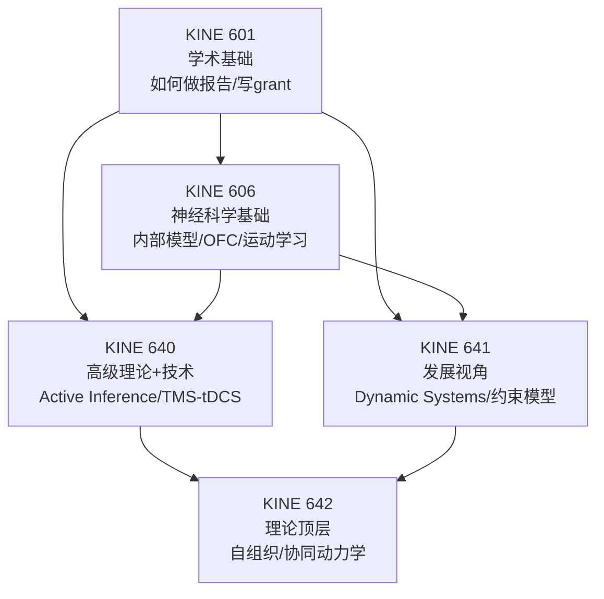

# 博士核心课程总览

TAMU Motor Neuroscience PhD 五门核心课程。以下每门课都有独立页面，含教授评价、学习资源、自编闪卡/考题、高分策略。

---

## 📋 五门课速览

| 课程 | 名称 | 学分 | 学期 | 授课教授 | 难度 | 独立页面 |
|------|------|------|------|----------|------|----------|
| **KINE 601** | Proseminar in Kinesiology | 1 | Fall | Buchanan | ⭐ | [KINE 601 →](KINE601-Proseminar.md) |
| **KINE 606** | Motor Neuroscience I | 3 | Fall | Buchanan / Wright | ⭐⭐⭐⭐ | [KINE 606 →](KINE606-Motor-Neuroscience-I.md) |
| **KINE 640** | Motor Neuroscience II | 3 | Spring | Lei / Buchanan / Du | ⭐⭐⭐⭐⭐ | [KINE 640 →](KINE640-Motor-Neuroscience-II.md) |
| **KINE 641** | Developmental Motor Neuroscience | 3 | Spring | Gabbard / 轮换 | ⭐⭐⭐ | [KINE 641 →](KINE641-Developmental.md) |
| **KINE 642** | Self-Organization in Movement | 3 | Spring | Buchanan | ⭐⭐⭐⭐ | [KINE 642 →](KINE642-Self-Organization.md) |

---

## 👨‍🏫 KNSM Motor Neuroscience 教授一览

| 教授 | 职称 | 办公室 | 研究方向 | 联系 | RMP |
|------|------|--------|----------|------|-----|
| **John J. Buchanan** | Professor & Program Chair | 333 GGB | 协调动力学、序列学习、动态系统 | jjbuchanan@tamu.edu | 2.4/5 |
| **David L. Wright** | Omar Smith Endowed Chair | 334 GGB | 运动技能巩固、练习安排、contextual interference | davidwright@tamu.edu | 2.1/5 ⚠️ 即将退休 |
| **Yuming Lei** | Associate Professor | 328 GGB | 脑刺激(TMS/tDCS)、运动学习、神经康复 | yxl907@tamu.edu | 4.0/5 |
| **Yue Du** | Assistant Professor | 315 GGB | 习惯形成、运动技能学习、计算建模 | yuedu@tamu.edu | 🆕 新老师 |
| **Matthew Scott** | Assistant Professor (2025加入) | — | 运动神经科学 | — | 🆕 |
| **Carl Gabbard** | Professor Emeritus | — | 终身运动发展、运动可供性 | — | — |

---

## 🔗 五门课的内在联系



### 推荐选课路径

```
Year 1 Fall:   KINE 601 + KINE 606
Year 1 Spring: KINE 640 + KINE 641 + KINE 642
```

---

## 📖 课程资源对比

| 维度 | 本科课 (406/426) | 博士课 (606/640/641/642) |
|------|-----------------|------------------------|
| 班级规模 | 30-60 人 | 8-15 人 |
| Quizlet/Stuvia | ✅ 丰富 | ❌ 几乎没有 |
| 考试形式 | 选择题 + 填空 + 简答 | 论文讨论 + presentation + final paper |
| 备考方式 | 刷闪卡 + 做往届题 | 读论文 + 批判讨论 + 研究 proposal |
| 你的角色 | 资源使用者 | **资源创造者**（你的笔记就是下届资源） |

---

## 🧭 每门课页面包含

!!! check "每个独立页面都有"
    - 📋 课程信息 + 教授教学风格 + RMP 评价分析
    - 🔬 核心知识体系拆解
    - 📝 自编 Quizlet 风格闪卡（概念卡片 40-80 张）
    - ✏️ 自编模拟考题（概念题 + 应用分析题）
    - 📚 分级阅读清单（入门 → 核心 → 前沿）
    - 🔥 高分策略 + 常见误区
    - 🔗 外部资源链接（YouTube、教程、工具）
