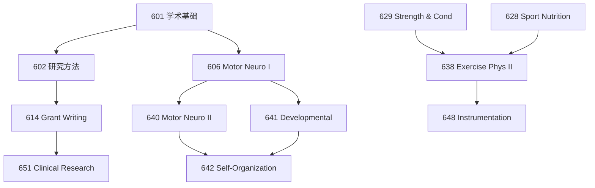

# 博士核心课程总览

TAMU Motor Neuroscience PhD 全部研究生课程。每门课都有独立页面，含教授评价、学习资源、自编闪卡/考题、高分策略。

---

## 📋 全部课程速览

### 🎓 博士必修

| 课程 | 名称 | 学分 | 学期 | 独立页面 |
|------|------|:---:|------|----------|
| **KINE 601** | Reading Research Publications in Kinesiology | 1 | Fall | [→](KINE601-Proseminar.md) |
| **KINE 602** | Fundamental Research Methods in Kinesiology | 3 | Fall/Spring | [→](KINE602-Research-Methods.md) |

### 🧠 Motor Neuroscience 核心

| 课程 | 名称 | 学分 | 学期 | 独立页面 |
|------|------|:---:|------|----------|
| **KINE 606** | Motor Neuroscience I | 3 | Fall | [→](KINE606-Motor-Neuroscience-I.md) |
| **KINE 640** | Motor Neuroscience II | 3 | Spring | [→](KINE640-Motor-Neuroscience-II.md) |
| **KINE 641** | Developmental Motor Neuroscience | 3 | Spring | [→](KINE641-Developmental.md) |
| **KINE 642** | Self-Organization in Movement | 3 | Spring | [→](KINE642-Self-Organization.md) |

### 💪 运动生理学

| 课程 | 名称 | 学分 | 学期 | 独立页面 |
|------|------|:---:|------|----------|
| **KINE 628** | Nutrition in Sport and Exercise | 3 | 按需 | [→](KINE628-Sport-Nutrition.md) |
| **KINE 629** | Physiology of Strength and Conditioning | 3 | 按需 | [→](KINE629-Strength-Conditioning.md) |
| **KINE 638** | Exercise Physiology II | 3 | Spring | [→](KINE638-Exercise-Physiology-II.md) |
| **KINE 648** | Instrumentation and Techniques in EP II | 3 | Spring | [→](KINE648-Instrumentation.md) |

### 📊 研究方法与基金

| 课程 | 名称 | 学分 | 学期 | 独立页面 |
|------|------|:---:|------|----------|
| **KINE 614** | External Research Fund Development | 3 | 按需 | [→](KINE614-Grant-Writing.md) |
| **KINE 651** | Introduction to Human Clinical Research | 3 | 按需 | [→](KINE651-Clinical-Research.md) |

### 📝 研讨与实践

| 课程 | 名称 | 学分 | 学期 | 独立页面 |
|------|------|:---:|------|----------|
| **KINE 681** | Seminar | 1 | 每学期 | [→](KINE681-Seminar.md) |
| **KINE 682** | Seminar in... | 1-3 | 按需 | [→](KINE682-Seminar.md) |
| **KINE 685** | Directed Studies | 1-9 | 每学期 | [→](KINE685-Directed-Studies.md) |
| **KINE 689** | Special Topics in... | 1-4 | 每学期 | [→](KINE689-Special-Topics.md) |

---

## 👨‍🏫 KNSM 教授一览

| 教授 | 职称 | 研究方向 | 联系 | RMP |
|------|------|----------|------|-----|
| **John J. Buchanan** | Professor & Program Chair | 协调动力学、序列学习、动态系统 | jjbuchanan@tamu.edu | 2.4/5 |
| **David L. Wright** | Omar Smith Endowed Chair | 运动技能巩固、contextual interference | davidwright@tamu.edu | 2.1/5 ⚠️ |
| **Yuming Lei** | Associate Professor | TMS/tDCS、运动学习、神经康复 | yxl907@tamu.edu | 4.0/5 |
| **Yue Du** | Assistant Professor | 习惯形成、计算建模、运动技能学习 | yuedu@tamu.edu | 🆕 |
| **Matthew Scott** | Assistant Professor (2025) | 运动神经科学 | — | 🆕 |
| **Carl Gabbard** | Professor Emeritus | 终身运动发展、运动可供性 | — | — |

---

## 🔗 课程关系图

---

## 🧭 每门课页面包含

!!! check "每个独立页面都有"
    - 📋 课程信息 + 核心知识体系
    - 📝 自编 Quizlet 风格闪卡（15-25 张）
    - ✏️ 自编模拟考题（3-5 题）
    - 📚 分级阅读清单 + 核心资源
    - 🔥 高分策略 + 常见误区
