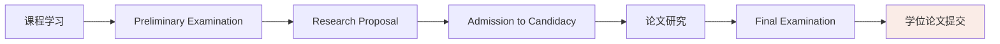

# 研究方法与学术要求

本页面详细介绍 TAMU Kinesiology PhD 所需的研究方法和学术技能，帮助你系统性地掌握博士研究的核心能力。

---

## 📋 学术要求总览

根据 TAMU 博士毕业要求，你需要完成以下学术里程碑：



---

## 🎓 Preliminary Examination（预备考试）

### 考试目的

评估以下资格：
1. **掌握所有专业领域的学科知识**
2. **充分了解相关领域的文献**，具备文献研究能力
3. **理解研究问题并掌握适当的研究方法**

### 考试资格

在 **ARCS 系统** 中申请考试，需满足：
- ✅ 学习计划（Degree Plan）已获 Graduate School 批准
- ✅ 无待处理的 DPSS 请求
- ✅ **累积 GPA ≥ 3.00** 且学位计划 GPA ≥ 3.00
- ✅ 在考试学期注册至少 **1 学分**
- ✅ 截至第一次考试结束时，批准的学习计划中**剩余课程 ≤ 6 学分**（不包括 681, 684, 690, 691 等 S/U 课程）

### 考试时间

- **最早**：剩余课程 ≤ 6 学分时
- **最晚**：完成正式课程后的下一学期结束前

### 考试形式

由你的学术单位和/或考试委员会决定，可能包括：
- **笔试**（Written Component）
- **口试**（Oral Component）
- **两者结合**

**重要规则**：
- 考试委员会**最多只能替换 1 名成员**（需 Graduate School 事先批准）
- 外部成员（External Member）的替换者**必须也来自外部单位**

### 评分与结果

- 结果：**通过（Pass）** 或 **不通过（Fail）**
- 要求：考试委员会**所有成员积极评价**，最多允许 **1 名成员反对**
- 结果必须在考试结束后 **10 个工作日内** 通过 ARCS 系统报告给 Graduate School

### ❌ 考试失败怎么办？

**第一次失败**：
- 考试委员会将提供**书面反馈**，说明不足之处
- 通常在 **6 个月后** 可以重考
- 需与委员会协商重新考试的时间

**第二次失败**：
- ❌ **不再有资格继续该博士项目**
- 学术单位将根据 Student Rule 12.5 通知你后续处理

### ⏰ 成绩有效期

Preliminary Examination 成绩从通过之日起 **4 年内有效**。超时需重考！

---

## 📝 Research Proposal（研究提案）

### 提交时间

- 完成正式课程后**尽快提交**
- **最晚**：在提交 Final Examination Request 前 **20 个工作日**

### 内容要求

你的研究提案必须包含：

| 部分 | 内容要求 | 页数建议 |
|------|----------|----------|
| **引言** | 研究背景、问题陈述、研究意义 | 2-3 页 |
| **文献综述** | 相关领域全面回顾、研究空白分析 | 5-8 页 |
| **研究目标/假设** | 明确的研究目标和可检验的假设 | 1 页 |
| **研究方法** | 实验设计、被试、设备、数据分析计划 | 3-5 页 |
| **预期结果** | 可能的结果及其意义 | 1-2 页 |
| **时间计划** | 研究各阶段的详细时间表 | 1 页 |
| **参考文献** | 完整的 APA 格式引用 | 不计入页数 |

**总页数**：通常 **15-25 页**（不含参考文献）

### 提案答辩流程

1. **提交给导师委员会**审阅
2. **召开提案答辩会议**（通常 1-2 小时）
3. 委员会提问并评估：
   - 研究问题的价值和可行性
   - 研究方法的适当性
   - 可用设施是否充足
4. **委员会投票**决定是否通过
5. 如需修改，根据反馈修订后重新提交

### 合规要求（重要！）

如果你的研究涉及以下内容，**必须在提交提案前**获得批准：
- 🧪 **人类被试**（IRB - Institutional Review Board）
- 🐭 **动物实验**（IACUC - Institutional Animal Care and Use Committee）
- 🦠 **生物危害/重组 DNA**（IBC - Institutional Biosafety Committee）

联系 [Office of Research Compliance and Biosafety](https://vpr.tamu.edu/research-compliance-and-biosafety/) 获取指导。

### 提交 ARCS 系统

通过委员会答辩后：
1. 登录 [Academic Requirements Completion System (ARCS)](https://arcs.tamu.edu/)
2. 上传最终版 Research Proposal
3. 获得 Graduate School 批准
4. **正式获得 Admission to Candidacy 资格**

---

## 🎯 Admission to Candidacy（获得博士候选人资格）

### 资格要求

你必须满足以下**所有条件**才能成为博士候选人：

| 要求 | 详细说明 |
|------|----------|
| ✅ 完成所有课程 | 学习计划上的所有课程（不包括 681, 684, 690, 691 等） |
| ✅ GPA 要求 | 累积 GPA ≥ 3.00，学位计划 GPA ≥ 3.00，且所有课程成绩 ≥ C |
| ✅ 通过 Preliminary Exam | 必须在有效期内（4 年） |
| ✅ 研究提案获批准 | 通过 ARCS 系统提交并获得 Graduate School 批准 |
| ✅ 满足住宿要求 | Residence Requirements（通常要求在 TAMU 校园内完成一定学分） |

### 意义

获得候选人资格后：
- 🎓 你可以使用 **"PhD Candidate"** 头衔
- 📖 可以全职专注于论文研究
- 🎯 **Final Examination 前必须获得此资格**

---

## 🛡️ Final Examination（毕业论文答辩）

### 考试资格

在 ARCS 系统中申请，需满足：
- ✅ 学位论文已接近完成，可供所有委员会成员审阅
- ✅ 所有成员有足够时间审阅稿件
- ✅ 累积 GPA ≥ 3.00，学位计划 GPA ≥ 3.00
- ✅ 学习计划中**无未清除的 D/F/U 成绩**
- ✅ 在答辩学期注册至少 **1 学分**（681, 684, 690, 691 等）
- ✅ **已获得 Admission to Candidacy**

### 申请时间

- 必须在**计划答辩日期前至少 10 个工作日** 在 ARCS 系统中提交申请
- 或按照 Graduate School 公布的截止日期（**以较早者为准**）

### 考试形式

- 由你的导师委员会进行
- 主要围绕**学位论文**进行
- 可能包括：
  - **笔试**（较少见）
  - **口试**（主要形式）
  - **公开部分**（通常口试的部分环节对外开放）
- 考试范围：候选人的**整个训练领域及相关主题**

### 评分与结果

- 要求：委员会**所有成员积极评价**，最多允许 **1 名成员反对**
- **仅有一次机会！** 必须慎重准备
- 结果必须在考试结束后 **10 个工作日内** 报告给 Graduate School

### ⏰ 成绩有效期

Final Examination 成绩从通过之日起 **1 年内有效**。超时需重考！

---

## 📖 Dissertation（学位论文）

### 论文要求

根据 TAMU 要求，博士学位论文必须：

1. **原创性研究**（Original Work）
   - 展示独立研究能力
   - 对学科有实质性贡献

2. **学术价值**（Scholarly Merit）
   - 达到可发表水平
   - 通过同行评审标准的严格评估

3. **写作质量**（Literary Workmanship）
   - 英语表达清晰准确
   - 符合学术写作规范

### 论文结构（典型）

```
1. Introduction（引言）
2. Literature Review（文献综述）
3. Methodology（研究方法）
4. Results（结果）- 可能分多章
5. Discussion（讨论）
6. Conclusion（结论）
7. References（参考文献）
8. Appendices（附录，如需要）
```

### 格式要求

**必须严格遵循** [Guidelines for Theses, Dissertations, and Records of Study](https://grad.tamu.edu/etd)：

- 📏 **页边距**：上下左右至少 1 英寸
- 🔤 **字体**：Times New Roman 或 Arial，12 号
- 📄 **行距**：双倍行距（某些部分可单倍）
- 🔢 **页码**：居中底部
- 📚 **引用格式**：APA 第 7 版（Kinesiology 领域标准）

### 提交流程

1. **通过 Final Examination** 后
2. 根据委员会意见**修改论文**
3. 获得导师委员会主席和系主任（或项目主席）批准
4. 通过 [Thesis and Dissertation Submission System (Vireo)](https://etd.tamu.edu/) 提交：
   - 单个 PDF 文件
   - 所有图片嵌入（不能是链接）
   - 文件大小通常 < 200MB
5. Graduate School 审核格式
6. 如需修改，根据反馈修订并重新提交
7. **最终批准后**，论文将被数字化存储并可在线访问

### 费用

- 提交时收取**一次性论文审核处理费**
- 费用通过 Student Business Services 收取
- 金额每年可能调整，请咨询 Graduate School

---

## 🔬 研究方法核心技能

### 1. 实验设计（Experimental Design）

**你必须掌握的实验设计类型**：

| 设计类型 | 适用场景 | 推荐课程 |
|---------|----------|----------|
| **被试内设计**（Within-Subjects） | 每个被试接受所有条件 | KINE 689, STAT 636 |
| **被试间设计**（Between-Subjects） | 不同被试接受不同条件 | KINE 689, STAT 636 |
| **混合设计**（Mixed Design） | 部分因素被试内，部分被试间 | STAT 636, STAT 638 |
| **因子设计**（Factorial Design） | 检验多个自变量的主效应和交互效应 | STAT 608, STAT 636 |

**关键概念**：
- 🎯 **内部效度**（Internal Validity）：控制混淆变量
- 🌍 **外部效度**（External Validity）：结果的可推广性
- ⚖️ **统计效度**（Statistical Conclusion Validity）：统计检验的正确使用
- 📏 **构念效度**（Construct Validity）：操作化定义的有效性

### 2. 统计分析方法

**基础统计**（必须掌握）：
- ✅ 描述统计（均值、标准差、置信区间）
- ✅ t 检验（独立样本、配对样本）
- ✅ 方差分析（ANOVA - One-way, Two-way, Repeated Measures）
- ✅ 相关与回归（Pearson, Spearman, Multiple Regression）
- ✅ 卡方检验（Chi-square）

**高级统计**（研究阶段需要）：
- 📊 **多元方差分析**（MANOVA）
- 📈 **多元回归**（Multiple Regression, Logistic Regression）
- 🔢 **主成分分析/探索性因子分析**（PCA/EFA）
- ✅ **验证性因子分析**（CFA）
- 📏 **结构方程模型**（SEM）
- 📊 **多层模型**（Multilevel Modeling / HLM）
- 🔁 **时间序列分析**（Time Series Analysis）

**推荐学习资源**：
- 📖 [Experimental Design (Kirk)](https://www.routledge.com/Experimental-Design-Procedures-for-Behavioral-Sciences/Kirk/p/book/9781412974455) - 实验设计圣经
- 📊 [Applied Multivariate Statistical Analysis (Johnson & Wichern)](https://www.pearson.com/us/higher-education/program/Johnson-Applied-Multivariate-Statistical-Analysis-6th-Edition/PGM244013.html) - 多元统计
- 🐍 [Python for Data Analysis (McKinney)](https://wesmckinney.com/book/) - Python 数据分析
- 📊 [R for Data Science (Wickham)](https://r4ds.had.co.nz/) - R 数据分析

### 3. 数据分析工具

**Python**（推荐优先学习）：
```python
# 必备库
import numpy as np          # 数值计算
import pandas as pd         # 数据处理
import matplotlib.pyplot as plt  # 绘图
import seaborn as sns       # 统计可视化
from scipy import stats     # 统计检验
import statsmodels.api as sm  # 统计模型
import pingouin as pg      # 心理学统计
```

**R**（统计分析强大）：
```r
# 必备包
library(tidyverse)     # 数据科学工作流
library(lme4)          # 线性混合模型
library(lavaan)         # 结构方程模型
library(ggplot2)        # 数据可视化
library(papaja)         # APA 格式输出
```

**MATLAB**（某些神经科学实验室使用）：
- 信号处理工具箱（Signal Processing Toolbox）
- 统计工具箱（Statistics and Machine Learning Toolbox）
- EEGLAB / FieldTrip（EEG 分析）

### 4. 学术写作

**论文写作流程**：

```
第1年：学习阶段
├── 阅读顶刊论文，学习写作风格
├── 写文献综述草稿
└── 学习 LaTeX 或完善 Word 技能

第2年：实践阶段
├── 撰写第一篇论文的 Introduction 和 Methods
├── 向导师寻求写作反馈
└── 参加 Writing Center 的写作工作坊

第3年：产出阶段
├── 完成第一篇可投稿的论文
├── 学习如何应对审稿意见
└── 开始撰写学位论文的章节

第4年：完成阶段
├── 完成学位论文全部章节
├── 根据委员会意见修改
└── 练习 Defense 演讲
```

**推荐资源**：
- 📖 [They Say / I Say (Graff & Birkenstein)](https://wwnorton.com/books/they-say-i-say/) - 学术写作模板
- 📖 [The Craft of Research (Booth et al.)](https://press.uchicago.edu/ucp/books/book/chicago/C/bo3641753.html) - 研究写作
- 📖 [Writing Science (Schs)](https://oxford.universitypressscholarship.com/view/10.1093/acprofile/9780199876270.001.0001/acprofile-9780199876270) - 科学写作
- 🔗 [Purdue OWL](https://owl.purdue.edu/owl/purdue_owl.html) - 在线写作实验室（免费）

**TAMU 校内资源**：
- [University Writing Center](https://writingcenter.tamu.edu/) - 一对一写作辅导
- [Office of Graduate and Professional Studies](https://grad.tamu.edu/) - 论文格式指导

### 5. 文献管理

**必备工具**：
- 📚 [Zotero](https://www.zotero.org/)（推荐）- 免费、开源、功能强大
- 📚 [EndNote](https://endnote.com/) - 付费、功能全面
- 📚 [Mendeley](https://www.mendeley.com/) - 免费、适合协作

**Zotero 使用技巧**：
1. 安装浏览器插件（一键抓取网页文献）
2. 安装 Word 插件（写作时自动插入引用）
3. 创建共享群组（与导师和实验室成员共享文献）
4. 学习使用标签（Tags）和关联文献（Related Items）功能
5. **定期备份**文献库（File → Export Library）

---

## 📅 时间规划建议

### 第一年：打好基础
```
Fall:  KINE 606 + STAT 652 + 文献管理工具学习
Spring: KINE 640 + STAT 608 + 开始阅读顶刊论文
```

### 第二年：深入研究和准备考试
```
Fall:  KINE 641/642 + STAT 636 + Preliminary Exam 准备
Spring: 完成课程 + 通过 Preliminary Exam + 开始撰写 Research Proposal
```

### 第三年：提案和候选人资格
```
Fall:  提交 Research Proposal + 获得 Candidacy + 开始数据收集
Spring: 全力进行研究和数据收集 + 第一篇论文草稿
```

### 第四年：完成论文和答辩
```
Fall:  完成数据分析 + 撰写学位论文 + 准备 Defense
Spring: 修改论文 + 通过 Final Examination + 提交学位论文 + 毕业！
```

---

## 🔗 相关链接

- [博士毕业要求](博士毕业要求.md) - 详细解读官方毕业要求
- [学习规划](学习规划.md) - 分学年详细规划
- [必修课程](必修课程/核心课程/index.md) - 按课程学习
- [学习工具](学习工具/index.md) - 掌握研究工具

---

**最后更新**：2026年5月

> 💡 **提示**：研究方法和学术技能需要**长期积累**。不要等到写论文时才学习统计分析或学术写作，尽早掌握这些技能！
